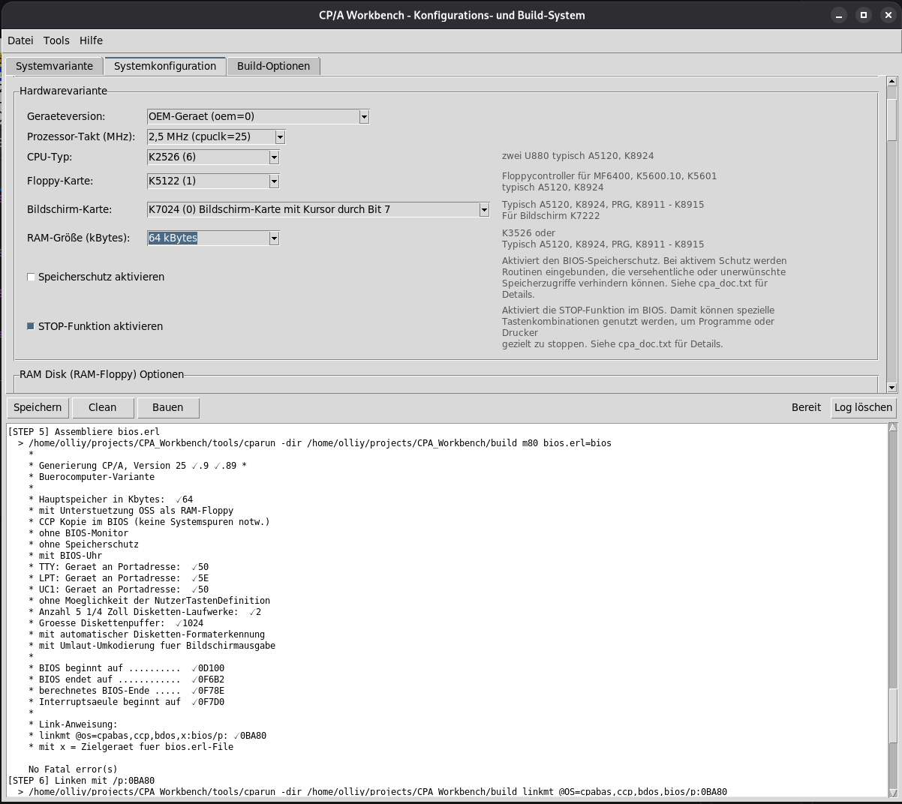

# CPA Workbench

[](./LICENSE)
[](https://github.com/olliy78/CPA_Workbench/releases)

This project provides a configuration and build tool for the CPA operating system, targeting classic East German computers of the K1520 series and the PC1715. It enables flexible selection of system variants, hardware options, and build parameters for reproducible builds and disk images. Note: The software and documentation are primarily in German, and it is assumed that there are probably no non-German-speaking users for this tool.

> **Hinweis:** Die Software und Dokumentation sind vollständig auf Deutsch gehalten.

## Tool zur Konfiguration des CPA Betriebssystems für Rechner der K1520-Reihe und des PC1715

Dieses Projekt stellt ein Konfigurationswerkzeug bereit, mit dem das CPA-Betriebssystem für verschiedene Rechner der K1520-Reihe und den PC1715 flexibel angepasst und gebaut werden kann. Über ein grafisches Menüsystem lassen sich Systemvarianten, Hardwareoptionen und Build-Parameter komfortabel auswählen und in reproduzierbaren Builds umsetzen.

Das CPA-Betriebssystem wurde ursprünglich in den 1980er Jahren für verschiedene 8-Bit-Computer entwickelt und jeweils an die spezifische Hardware angepasst. Daher existieren unterschiedliche Varianten im Quelltext, die sich im Detail durch Anpassungen an die Hardware und die im System verbauten EPROMs (Firmware) unterscheiden. In jüngerer Zeit wurden zudem inoffizielle Erweiterungen geschaffen, um neue oder geänderte Hardware zu unterstützen und die Funktionalität zu erweitern.


*Systemkonfiguration (oben) und Assembler-/Linker-Ausgabe während des Builds (unten)*

Durch die automatisierte Erstellung und das Schreiben von bootfähigen Systemdisketten oder Images für Diskettenemulatoren wird der Aufwand für das Testen und die Inbetriebnahme neuer Varianten erheblich reduziert.

## Versionshistorie

### Version 0.3.0

**Status:** Beta-Version für öffentliche Tests

**Änderungen gegenüber Version 0.2.0:**

- **CP/M-Emulator `cparun`:** In C++ geschrieben, Quelltext im Projekt enthalten. Läuft als `cparun` (Linux) bzw. `cparun.exe` (Windows) direkt aus dem `tools/`-Ordner
- **Neue Zusatztools:** `readDiskUI.py` (Disketten einlesen und Dateien extrahieren) und `writeDiskUI.py` (Disketten-Image erstellen und auf Diskette schreiben) als eigenständige GUI-Tools
- **Greaseweazle-Integration verbessert:** Live-Ausgabe während `gw read`/`gw write`, kein Timeout mehr
- **Format-Beschreibungen:** Die Combobox für das Diskettenformat zeigt nun den Kommentar aus der `diskdefs`-Datei als Beschreibung an
- **Option „Temporäre .img löschen":** Beide Disk-Tools können die temporäre Image-Datei nach der Operation auch behalten

### Version 0.2.0

**Status:** Beta-Version für öffentliche Tests

**Änderungen gegenüber Version 0.1.0:**

- Diverse Fehlerbeseitigungen und Stabilitätsverbesserungen
- CP/A Quelltext: Originaldateien wiederhergestellt
- Optimierungen am Build-Prozess und der Systemkonfiguration

### Version 0.1.0

**Status:** Initiale Version – erste öffentliche Version mit grundlegender Build-Funktionalität.

## Installationsanleitung

### Voraussetzungen (alle Betriebssysteme)

- **Python 3.8 oder neuer** mit `tkinter` (wird bei den meisten Installationen mitgeliefert)
- **CP/M-Tools `cpmcp` und `cpmls`** (liegen als vorkompilierte Binaries im Ordner `tools/`)
- **CP/M-Emulator `cparun` / `cparun.exe`** (liegt im Ordner `tools/`, Quelltext im Projekt enthalten)
- Optional: **Greaseweazle** (`gw`) für das Lesen/Schreiben physikalischer Disketten und die Konvertierung in HFE/SCP-Formate
   - Eine manuelle Installation.Das Tool wird bei Bedarf automatisch im Projekt unter `.venv/greaseweazle/` nachgeladen.

### Linux

**Benötigte Pakete installieren (Debian/Ubuntu):**

```sh
sudo apt install python3 python3-tk
```

**Benötigte Pakete installieren (Fedora/RHEL):**

```sh
sudo dnf install python3 python3-tkinter
```

**Benötigte Pakete installieren (Arch Linux):**

```sh
sudo pacman -S python tk
```

**CPA Workbench starten:**

```sh
python3 cpa_workbench.py
```

Für die CP/M-Tools `cpmcp` und `cpmls` liegen im Ordner `tools/` unter Debian Linux kompilierte Versionen bei. Sollten diese nicht funktionieren, wird empfohlen, die CP/M-Tools aus dem Quelltext zu übersetzen. Das mit Debian ausgelieferte Binärpaket ist fehlerhaft und verhält sich bei den hier verwendeten Diskettenformaten nicht wie erwartet.

### Windows

1. **Python installieren (winget):**

```powershell
winget install --id Python.Python.3.12 -e --scope user
```

Hinweis zu Administratorrechten:
- Für die Installation nur für den aktuellen Benutzer (`--scope user`) sind keine Admin-Rechte erforderlich.
- Für eine systemweite Installation (alle Benutzer) sind Admin-Rechte erforderlich.

2. Das Projekt als .zip-Datei herunterladen oder per `git clone` klonen.
3. Die CPA Workbench starten:

```bat
start_cpa_workbench.bat
```

oder direkt:

```
python3 cpa_workbench.py
```

Im Ordner `tools` befinden sich außerdem die Windows-Versionen der CP/M-Tools (`cpmcp.exe`, `cpmls.exe`) sowie `cparun.exe`.

Greaseweazle-Hinweis:
- Für den normalen Betrieb ist keine manuelle Greaseweazle-Installation nötig.
- Sobald eine Funktion Greaseweazle benötigt (z.B. HFE/SCP oder direktes Schreiben/Lesen), wird die Windows-Version automatisch nachgeladen und lokal im Projekt abgelegt.

### Windows-Installer (Wizard) erstellen

Für die Weitergabe an Windows-Anwender gibt es im Projekt ein Inno-Setup-Skript:

- `installer/CPA_Workbench_Windows.iss`
- `installer/build_installer.bat`

Variante B (kleine Setup-Datei):
- Python wird nur bei Bedarf per `winget` nachinstalliert.
- Greaseweazle wird bei Bedarf automatisch durch die Anwendung nachgeladen.

**Inno Setup installieren:**

```powershell
winget install --id JRSoftware.InnoSetup -e --scope user
```

Hinweis zu Administratorrechten:
- Mit `--scope user` ist in der Regel keine Administrator-PowerShell erforderlich.
- Für eine systemweite Installation kann eine Administrator-PowerShell erforderlich sein.

**Installer bauen:**

```bat
installer\build_installer.bat
```

Ausgabe:
- `installer\Output\CPA_Workbench_Setup.exe`

### macOS

Für macOS muss `cparun` aus dem enthaltenen C++-Quelltext selbst kompiliert werden. Für die CP/M-Tools `cpmcp` und `cpmls` müssen ebenfalls die Quellen kompiliert werden, da im Ordner `tools/` nur Linux-Binaries enthalten sind.

**Voraussetzungen installieren (mit Homebrew):**

```sh
brew install python python-tk
```

## Verzeichnisstruktur

```
CPA_Workbench/
├── cpa_workbench.py      – Hauptprogramm (startet die GUI)
├── start_cpa_workbench.bat – Windows-Startskript für die GUI
├── diskdefs              – CP/M-Dateisystem-Definitionen (cpmtools-Format)
├── cpaFormates.cfg       – Physikalische Diskettengeometrien (Greaseweazle-Format)
├── src/                  – Quelltexte für BIOS, Makros und Systemteile
│   └── <systemvariante>/ – z.B. bc_a5120/ oder pc_1715/
├── prebuilt/             – Vorgefertigte Systemteile (BDOS.ERL, CCP.ERL, bootsec.bin …)
│   └── <systemvariante>/
├── config/               – Konfigurations-Skripte und Kconfig-Dateien
│   └── <systemvariante>/
│       ├── Kconfig.system
│       └── Makefile
├── additions/            – Dateien, die auf jede Systemdiskette kopiert werden
│   └── <systemvariante>/ – Systemvariantenspezifische Zusatztools
├── tools/                – Build- und Hilfswerkzeuge
│   ├── cparun            – CP/M-Emulator (Linux)
│   ├── cparun.exe        – CP/M-Emulator (Windows)
│   ├── cparun_src/       – C++-Quelltext von cparun
│   ├── cpmcp / cpmcp.exe – CP/M-Dateikopier-Tool
│   ├── cpmls / cpmls.exe – CP/M-Dateilisten-Tool
│   ├── m80.com           – Macro-Assembler (CP/M-Programm)
│   ├── linkmt.com        – Linker (CP/M-Programm)
│   ├── readDiskUI.py     – GUI: Disketten einlesen / Dateien extrahieren
│   ├── writeDiskUI.py    – GUI: Disketten-Image erstellen und schreiben
│   ├── extract_files     – Kommandozeilen-Tool zum Extrahieren von Dateien
├── build/                – Build-Artefakte und temporäre Dateien
└── doc/                  – Dokumentation und Screenshots
```

## Build-System Übersicht

Das CPA Workbench Build-System bietet eine grafische Benutzeroberfläche (GUI) zur Konfiguration und zum Bau des CPA-Betriebssystems. Es basiert vollständig auf Python.

### Starten der CPA Workbench

```sh
python3 cpa_workbench.py
```

Es öffnet sich ein grafisches Fenster mit drei Tabs, einem Log-Bereich und einer Menüleiste.

### Tab 1: Systemvariante

Im ersten Tab wird die gewünschte Systemvariante ausgewählt (z.B. BC A5120 oder PC1715). Die Varianten werden automatisch aus dem Ordner `src/` erkannt. Zu jeder Variante wird (sofern vorhanden) der Inhalt der `about.txt` als Beschreibung angezeigt.

Beim Wechsel der Variante werden die aktuellen Konfigurationswerte automatisch aus den Assembler-Quelldateien ausgelesen.

### Tab 2: Systemkonfiguration

Im zweiten Tab können Hardwaredetails und Systemoptionen konfiguriert werden. Der Inhalt dieses Tabs wird dynamisch aus der Datei `config/<systemvariante>/Kconfig.system` geladen und ändert sich mit der gewählten Variante. Je nach Variante stehen folgende Konfigurationskategorien zur Verfügung:

- **Hardwarevariante:** Geräteversion, Prozessortakt, CPU-Typ, Floppy-Karte, Bildschirm-Karte, RAM-Größe
- **RAM Disk Optionen:** OSS, EM256, MKD256, RAF, NANOS
- **Diskettenlaufwerke:** Typ und Format für Laufwerk A–D
- **Systemstart:** Autoexec-Befehl, Kaltstart/Reset-Verhalten
- **Systemfunktionen:** Uhr, Formaterkennung, Monitor, Umlaute usw.
- **Serielle Schnittstellen:** Drucker 1/2, Koppelschnittstelle mit Adressen und Parametern

Zu jeder Option kann über den **[?]**-Button ein Hilfetext eingeblendet werden.

### Tab 3: Build-Optionen

Im dritten Tab wird das Build-Ziel festgelegt:

| Option | Beschreibung |
|--------|-------------|
| **Nur @OS.COM bauen** | Erstellt nur das Betriebssystem im `build/`-Verzeichnis |
| **Diskettenimage als *.img** | Erstellt ein CP/M-kompatibles Diskettenimage |
| **Diskettenimage als *.hfe** | Erstellt ein HFE-Image für Diskettenemulatoren |
| **Diskettenimage als *.scp** | Erstellt ein SCP-Image |
| **Auf Laufwerk schreiben** | Schreibt das Image direkt auf eine physikalische Diskette (Greaseweazle nötig) |

Zusätzlich kann gewählt werden:

- **Clean vor Build:** Löscht alte Build-Artefakte vor dem Bauen
- **Diskettentyp:** 780 kByte (A5120 mit Bootspuren) oder 800 kByte (PC1715)

### Build starten

Über die Schaltflächen am unteren Rand des Fensters:

- **Speichern** – Sichert die aktuelle Konfiguration in `.config`
- **Clean** – Leert das `build/`-Verzeichnis
- **Bauen** – Speichert die Konfiguration, patcht die Assembler-Quellen und führt den vollständigen Build aus

Der Build-Fortschritt wird im Log-Bereich am unteren Fensterrand angezeigt. Das Fenster bleibt während des Builds bedienbar.

### Build-Prozess im Detail

Der Build-Prozess umfasst folgende automatische Schritte:

1. `build/`-Verzeichnis vorbereiten (optional: bereinigen)
2. `.mac`-Quelldateien und `.erl`-Prebuilt-Dateien ins `build/`-Verzeichnis kopieren
3. Assembler-Quellen mit den konfigurierten Werten patchen
4. BIOS-Quelle mit `cparun m80` assemblieren (erzeugt Listing und `.erl`-Datei)
5. Ladeadresse `/p:` aus dem Assembler-Log extrahieren
6. Mit `cparun linkmt` zu `@OS.COM` linken
7. Bootsektor (`bootsec.bin`) ins Image schreiben (falls Diskettenimage gewählt)
8. Zusatzdateien aus `additions/` auf das Image kopieren
9. Optional: Image in HFE/SCP konvertieren oder auf Diskette schreiben

`cparun` (bzw. `cparun.exe` unter Windows) ist ein in C++ geschriebener CP/M-Emulator, dessen Quelltext im Projekt enthalten ist.

### Konfigurationsdatei `.config`

Die gesamte Konfiguration wird in der Datei `.config` im Projektverzeichnis gespeichert. Das Format entspricht dem Kconfig-Standard und kann auch manuell bearbeitet werden.

## Zusatztools: readDiskUI und writeDiskUI

Über die Menüleiste der CPA Workbench (Menü „Tools") sind zwei eigenständige GUI-Tools erreichbar:

### readDiskUI – Disketten einlesen

`tools/readDiskUI.py` ermöglicht das Einlesen von CP/M-Disketten und das Extrahieren von Dateien:

- **Quelle:** Image-Datei (`.img`, `.hfe`, `.scp`) oder physische Diskette über Greaseweazle
- **Disketteninhalt anzeigen:** Listet alle Dateien auf der Diskette auf
- **Dateien extrahieren:** Kopiert alle Dateien in ein wählbares Zielverzeichnis
- HFE/SCP-Images werden automatisch in ein temporäres `.img` konvertiert
- Diskettenformat aus `diskdefs` wählbar – mit Beschreibungstext pro Format
- Option: Temporäre `.img`-Datei nach der Operation löschen oder behalten

```sh
python3 tools/readDiskUI.py
```

### writeDiskUI – Disketten erstellen

`tools/writeDiskUI.py` erstellt aus einem Ordner voller Dateien ein CP/M-Disketten-Image und schreibt es optional auf eine physische Diskette:

- **Quelle:** Beliebiges Verzeichnis mit zu schreibenden Dateien
- **Ausgabe:** `.img`, `.hfe` oder `.scp`-Datei oder direkt auf Diskette (Greaseweazle)
- Vorschau der Quelldateien mit Größenangaben
- Temporäres Image mit CP/M-Standard (0xE5) vorgefüllt
- Diskettenformat aus `diskdefs` wählbar – mit Beschreibungstext pro Format
- Option: Temporäre `.img`-Datei nach der Operation löschen oder behalten

```sh
python3 tools/writeDiskUI.py
```

## Diskettenformate: diskdefs und cpaFormates.cfg

Die Diskettenformate für das Erstellen von Images und das Einlesen von Disketten sind in zwei Dateien beschrieben:

- **`diskdefs`**: CP/M-Dateisystem-Definitionen (Sektorgröße, Anzahl der Tracks, Verzeichnisstruktur). Wird von cpmtools (`cpmcp`, `cpmls`) und beim Erstellen von Images verwendet.
- **`cpaFormates.cfg`**: Physikalische Diskettengeometrie und Aufzeichnungsverfahren (Zylinder, Köpfe, MFM-Codierung). Wird von Greaseweazle beim direkten Diskettenzugriff verwendet.

Beide Dateien können angepasst werden, wenn z.B. Disketten von anderen Systemen gelesen oder für andere Formate Images erstellt werden sollen.

### Diskettenformate im Überblick

#### 800 kByte – PC1715 (`cpa800`)

- 80 Zylinder, 2 Köpfe (Double Side)
- 5 Sektoren à 1024 Bytes pro Track
- Keine separaten Bootspuren; bootfähig durch spezielle Einträge in der Directory Allocation Table

#### 780 kByte – BC A5120 (`cpa780`)

- 80 Zylinder, 2 Köpfe (Double Side)
- Bootspuren: Spuren 0–2 mit 26 Sektoren à 128 Bytes
- Datenspuren: 5 Sektoren à 1024 Bytes
- Separate Bootspuren am Anfang der Diskette

### bootsec.bin

Für die Erstellung bootfähiger Images wird die Datei `bootsec.bin` aus dem jeweiligen `prebuilt/<systemvariante>/`-Ordner verwendet. Die Build-Engine schreibt sie automatisch an die korrekte Stelle im Diskettenimage.

## Zusatztool: extract_files (Kommandozeile)

Das Skript `tools/extract_files` extrahiert alle Dateien aus einem CP/M-Diskettenimage oder direkt von einer Diskette (über Greaseweazle) in einen neuen Unterordner.

```sh
tools/extract_files [-t FORMAT] -f <disk_image.img> | -g <DiskName>
```

| Parameter | Beschreibung |
|-----------|-------------|
| `-t FORMAT` | Dateisystemformat für cpmtools (Standard: `cpa800`) |
| `-f FILE` | Image-Datei einlesen (`.img`) |
| `-g DiskName` | Diskette mit Greaseweazle einlesen (legt `DiskName.img` temporär an) |
| `-h` | Hilfe anzeigen |

Die extrahierten Dateien werden im Ordner `Disketten/<ImageName>/` abgelegt. Um sie auf neue Disketten zu übernehmen, können sie in den `additions/`-Ordner (ggf. systemvariantenspezifischen Unterordner) kopiert werden.

## Erweiterte Möglichkeiten für Entwickler

### Eigene Systemvariante anlegen

1. **Verzeichnisse anlegen:**
   - `src/<neue_variante>/` – Quelltexte (z.B. von `src/bc_a5120/` kopieren)
   - `prebuilt/<neue_variante>/` – Vorgefertigte Systemteile (BDOS.ERL, CCP.ERL, bootsec.bin)
   - `config/<neue_variante>/Kconfig.system` – Konfigurationsdatei
   - `additions/<neue_variante>/` – Systemspezifische Zusatztools

2. **Kconfig.system anpassen:**

   Jede Option enthält einen Datentyp und einen Symbolnamen, der in der `.mac`-Datei verwendet wird:

   | Typ | Bedeutung |
   |-----|-----------|
   | `bool` | Ein-/Ausschalter |
   | `hexstring` | Hexadezimalwert (z.B. I/O-Adresse) |
   | `string` | Freitext (z.B. Autoexec-Kommando) |

   Beispiele:

   ```kconfig
   config SYSTEM_RAMDISK_RAF
       bool "RAF-Karte (raf=1)"
       help
           source=bios.mac oss=0 em256=0 raf=1
           Nutzt mindestens eine RAF-Karte (max. 4, je 2 MB) als RAM-Floppy 'M:'.

   config SYSTEM_SERIAL_TTYDAT
       string "ttydat (Daten-Adresse Drucker 1)"
       help
           source=bios.mac ttydat=hexstring
           Datenadresse für Drucker 1. Mögliche Anschlüsse: 0Ch, 0Dh, 14h, 15h …
   ```

3. **Build starten:** GUI mit `python3 cpa_workbench.py` öffnen und neue Variante im Tab „Systemvariante" auswählen.

**Tipp:** Starte mit einer Kopie einer lauffähigen Variante (z.B. `bc_a5120`) und passe die Dateien schrittweise an.

### Hinweise zum Build-System

- Die Build-Engine (`tools/cpa_builder.py`) erkennt die Hauptquelldatei automatisch anhand der `Kconfig.system`-Einträge oder des Dateisystems (`biop.mac` hat Priorität vor `bios.mac`).
- Die Ladeadresse für den Linker wird automatisch aus der M80-Assembler-Ausgabe extrahiert.
- Die CP/M-Tools können keine Verzeichnisse verarbeiten – alle benötigten Dateien werden vor dem Build ins `build/`-Arbeitsverzeichnis kopiert.

## Lizenz

Die CPA-Workbench (alle eigenen Skripte, Buildsysteme und Dokumente in diesem Repository) steht unter der **MIT-Lizenz**. Siehe Datei [LICENSE](./LICENSE).

**Wichtige Hinweise:**

- Die MIT-Lizenz gilt **ausschließlich** für die eigenen Dateien der CPA-Workbench (Skripte, Buildsystem, Dokumentation).
- Das Betriebssystem **CP/A** sowie alle mitgelieferten Originaldateien aus CP/A (einschließlich `cpa_doc.txt`) unterliegen anderen Lizenzen und sind von der MIT-Lizenz ausgenommen.
- Die externen Tools im Ordner `tools/` (Greaseweazle, cpmtools, m80, linkmt) stehen jeweils unter eigenen Lizenzen.

---

## Bug-Reports und Erweiterungswünsche

Für Fehler, Verbesserungsvorschläge oder neue Funktionen nutze bitte das [GitHub-Ticketsystem (Issues)](https://github.com/olliy78/CPA_Workbench/issues).

- **Fehlerberichte:** Vorlage „Fehlerbericht"
- **Erweiterungswünsche:** Vorlage „Erweiterungswunsch"
- **Fragen:** Auch allgemeine Fragen können als Issue eingestellt werden

Bitte prüfe vor dem Erstellen eines neuen Tickets, ob das Thema bereits gemeldet wurde.

Für allgemeine Fragen und Diskussionen steht auch das Forum von [robotrontechnik.de](https://www.robotrontechnik.de) zur Verfügung.
