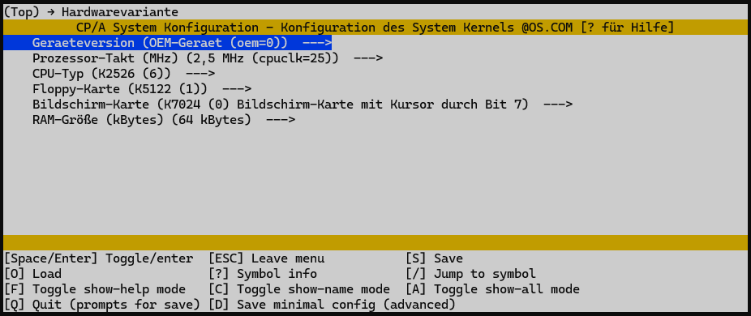
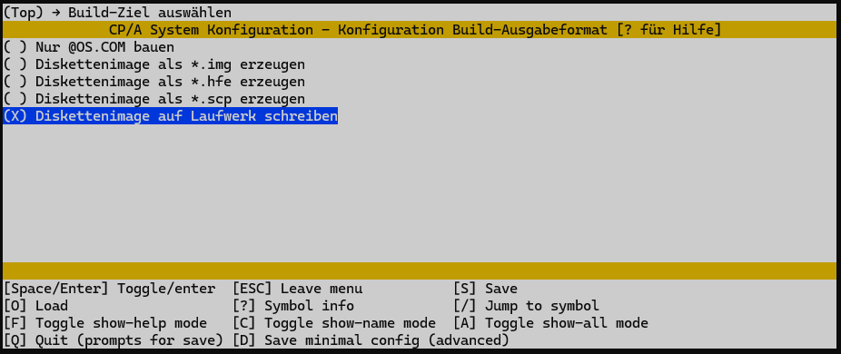
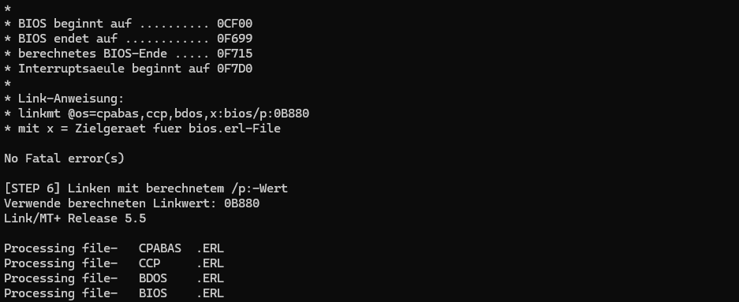

# CPA Workbench

[](./LICENSE)
[](https://github.com/olliy78/CPA_Workbench/releases)

This project provides a configuration and build tool for the CPA operating system, targeting classic East German computers of the K1520 series and the PC1715. It enables flexible selection of system variants, hardware options, and build parameters for reproducible builds and disk images. Note: The software and documentation are primarily in German, and it is assumed that there are probably no non-German-speaking users for this tool.

## Tool zur Konfiguration des CPA Betriebssystems für Rechner der K1520-Reihe und des PC1715

Dieses Projekt stellt ein Konfigurationswerkzeug bereit, mit dem das CPA-Betriebssystem für verschiedene Rechner der K1520-Reihe und den PC1715 flexibel angepasst und gebaut werden kann. Über ein menübasiertes System lassen sich Systemvarianten, Hardwareoptionen und Build-Parameter komfortabel auswählen und in reproduzierbaren Builds umsetzen.


*Abbildung 1: Konfigurationsmenü - Hardwarevariante BC A5120

Das CPA-Betriebssystem wurde ursprünglich in den 1980er Jahren für verschiedene 8-Bit-Computer entwickelt und jeweils an die spezifische Hardware angepasst. Daher existieren unterschiedliche Varianten im Quelltext, die sich im Detail durch Anpassungen an die Hardware und die im System verbauten EPROMs (Firmware) unterscheiden. In jüngerer Zeit wurden zudem inoffizielle Erweiterungen geschaffen, um neue oder geänderte Hardware zu unterstützen und die Funktionalität zu erweitern.


*Abbildung 2: Konfigurationsmenü - Auswahl Build Ziel

Dieses Konfigurations- und Buildsystem hilft dabei, verschiedene CP/A-Varianten komfortabel zu konfigurieren und zu generieren. Es unterstützt Entwickler und Anwender bei der Anpassung, Weiterentwicklung und dem Test von Erweiterungen und ermöglicht reproduzierbare Builds für unterschiedliche Zielsysteme.


*Abbildung 3: Ausgabe Assembler und Linker mit Übergabe der Adresse

Durch die automatisierte Erstellung und das Schreiben von bootfähigen Systemdisketten oder Images für Diskettenemulatoren wird der Aufwand für das Testen und die Inbetriebnahme neuer Varianten erheblich reduziert.

## Versionshistorie

### Version 0.2.0 (Beta)

**Status:** Beta-Version für öffentliche Tests

**Änderungen gegenüber Version 0.1.0:**

- **Fehlerbeseitigungen:** Diverse Bugs wurden behoben, um die Stabilität und Zuverlässigkeit des Build-Systems zu verbessern
- **CP/A Quelltext:** Alle Änderungen im CP/A Quelltext wurden zurückgesetzt, um die Originalversion zu verwenden
- **Verbesserungen:** Optimierungen am Build-Prozess und der Systemkonfiguration

**Hinweis:** Version 0.2.0 ist weiterhin als Beta-Version zu verstehen und befindet sich in der öffentlichen Testphase.

### Version 0.1.0

**Status:** Initiale Version

Dies war die erste öffentliche Version der CPA Workbench mit grundlegender Funktionalität für das Konfigurieren und Bauen von CP/A-Betriebssystemen.

## Installationsanleitung

### Voraussetzungen (alle Betriebssysteme)

- **Python 3.8 oder neuer** (mit `tkinter` – wird bei den meisten Installationen mitgeliefert)
- **CP/M-Emulator `cpm.exe`** (liegt im Ordner `tools/`)
- **CP/M-Tools `cpmcp` und `cpmls`** (liegen im Ordner `tools/`)
- Optional: **Greaseweazle** (`gw`) für das Schreiben auf physikalische Disketten und die Konvertierung in HFE/SCP-Formate – wird bei Bedarf automatisch in eine virtuelle Umgebung (`.venv`) installiert

### Windows

1. Das Projekt als .zip-Datei herunterladen oder per `git clone` klonen.
2. Im Ordner `tools` die Datei `win_tools.7z` mit 7-Zip entpacken. Sie enthält unter anderem:
   - **python3**: Minimale Python-3-Umgebung (mit tkinter)
   - **greaseweazle**: Tool zum Lesen/Schreiben von Disketten und zur Konvertierung von Image-Formaten
3. Die CPA Workbench starten:

```
python3 cpa_build.py
```

oder per Doppelklick auf `cpa_build.py`, falls Python mit `.py`-Dateien verknüpft ist.

Zusätzlich befinden sich im Ordner `tools` die CP/M-Tools `cpmcp.exe`, `cpmls.exe` und der CP/M-Emulator `cpm.exe`.

### Linux

Für die Verwendung unter Linux wird der Windows-Emulator **Wine** benötigt, da der verwendete CP/M-Emulator nur als 32-Bit-Windows-Version verfügbar ist.

**Benötigte Pakete installieren (Debian/Ubuntu):**

```sh
sudo apt install python3 python3-tk wine
```

**Benötigte Pakete installieren (Fedora/RHEL):**

```sh
sudo dnf install python3 python3-tkinter wine
```

**Benötigte Pakete installieren (Arch Linux):**

```sh
sudo pacman -S python tk wine
```

Für die CP/M-Tools `cpmcp` und `cpmls` liegen im Ordner `tools` bereits unter Debian Linux kompilierte Versionen bei. Sollten diese nicht funktionieren, wird empfohlen, die CP/M-Tools selbst aus dem Quelltext zu übersetzen. Das mit Debian ausgelieferte Binärpaket ist fehlerhaft und verhält sich bei den hier verwendeten Diskettenformaten nicht wie erwartet.

**CPA Workbench starten:**

```sh
python3 cpa_build.py
```

### macOS

Unter macOS wird ebenfalls **Wine** benötigt, um den CP/M-Emulator auszuführen.

**Voraussetzungen installieren (mit Homebrew):**

```sh
brew install python python-tk
brew install --cask wine-stable
```

Für die CP/M-Tools `cpmcp` und `cpmls` müssen unter macOS die Quellen selbst kompiliert werden, da im Ordner `tools` nur Linux-Binaries beiliegen.

**CPA Workbench starten:**

```sh
python3 cpa_build.py
```

## Verzeichnisstruktur

- `src/`         – Quelltexte für BIOS, Makros und Systemteile
- `prebuilt/`    – Vorgefertigte Systemteile (z.B. BDOS.ERL, CCP.ERL, CPABAS.ERL)
  - Zusätzlich: `bootsec.bin` – Bootsektor-Datei für die Erstellung bootfähiger Disketten/Images
- `tools/`       – Build-Tools (m80.com, linkmt.com, cpm.exe, ...)
- `build/`       – Build-Produkte und temporäre Dateien (wird bei jedem Build neu befüllt)
- `doc/`         – Dokumentation (z.B. cpa_doc.txt)
- `config/`      – Konfigurations-Skripte und Kconfig-Dateien

## Build-System Übersicht

Das CPA Workbench Build-System bietet eine grafische Benutzeroberfläche (GUI) zur Konfiguration und zum Bau des Systems. Es basiert vollständig auf Python und benötigt keine Makefiles, Bash-Skripte oder GNU-Tools mehr.

### Starten der CPA Workbench

Die CPA Workbench wird auf allen Betriebssystemen einheitlich gestartet:

```sh
python3 cpa_build.py
```

Es öffnet sich ein grafisches Fenster mit drei Tabs und einem Log-Bereich.

### Tab 1: Systemvariante

Im ersten Tab wird die gewünschte Systemvariante ausgewählt (z.B. BC A5120, PC1715 oder andere verfügbare Varianten). Die Varianten werden automatisch aus dem Ordner `src/` erkannt. Zu jeder Variante wird (sofern vorhanden) der Inhalt der `about.txt` als Beschreibung angezeigt.

Beim Wechsel der Variante werden die aktuellen Konfigurationswerte automatisch aus den Assembler-Quelldateien ausgelesen.

### Tab 2: Systemkonfiguration

Im zweiten Tab können Hardwaredetails und Systemoptionen konfiguriert werden. Der Inhalt dieses Tabs wird dynamisch aus der Datei `config/<systemvariante>/Kconfig.system` geladen und ändert sich mit der gewählten Variante. Je nach Variante stehen folgende Konfigurationskategorien zur Verfügung:

- **Hardwarevariante:** Geräteversion, Prozessortakt, CPU-Typ, Floppy-Karte, Bildschirm-Karte, RAM-Größe
- **RAM Disk Optionen:** Auswahl der RAM-Floppy-Hardware (OSS, EM256, MKD256, RAF, NANOS)
- **Diskettenlaufwerke:** Typ und Format für Laufwerk A–D
- **Systemstart:** Autoexec-Befehl, Kaltstart/Reset-Verhalten
- **Systemfunktionen:** Uhr, Formaterkennung, Monitor, Umlaute usw.
- **Serielle Schnittstellen:** Drucker 1/2, Koppelschnittstelle mit Adressen und Parametern

Zu jeder Option kann über den **[?]**-Button ein Hilfetext angezeigt werden.

### Tab 3: Build-Optionen

Im dritten Tab wird das Build-Ziel festgelegt:

| Option | Beschreibung |
|--------|-------------|
| **Nur @OS.COM bauen** | Erstellt nur das Betriebssystem im `build/`-Verzeichnis |
| **Diskettenimage als *.img** | Erstellt ein CP/M-kompatibles Diskettenimage |
| **Diskettenimage als *.hfe** | Erstellt ein HFE-Image für Diskettenemulatoren |
| **Diskettenimage als *.scp** | Erstellt ein SCP-Image |
| **Auf Laufwerk schreiben** | Schreibt das Image direkt auf eine physikalische Diskette (Greaseweazle nötig) |

Zusätzlich kann gewählt werden:

- **Clean vor Build:** Löscht alte Build-Artefakte vor dem Bauen
- **Diskettentyp:** 780 kByte (A5120 mit Bootspuren) oder 800 kByte (PC1715)

### Build starten

Über die Schaltflächen am unteren Rand des Fensters:

- **Speichern** – Sichert die aktuelle Konfiguration in `.config`
- **Clean** – Leert das `build/`-Verzeichnis
- **Bauen** – Speichert die Konfiguration, patcht die Assembler-Quellen und führt den vollständigen Build aus

Der Build-Fortschritt wird im Log-Bereich am unteren Fensterrand angezeigt. Das Fenster bleibt während des Builds bedienbar.

### Konfigurationsdatei `.config`

Die gesamte Konfiguration wird in der Datei `.config` im Projektverzeichnis gespeichert. Das Format ist kompatibel mit dem bisherigen menuconfig-System. Die Datei kann auch manuell bearbeitet werden.

### Systemvarianten und Ordnerstruktur

Das Build-System erkennt Systemvarianten automatisch anhand der Ordnerstruktur:

- **Quelltexte:** `src/<systemvariante>/` (z.B. `src/pc_1715/`)
- **Konfiguration:** `config/<systemvariante>/Kconfig.system`
- **Prebuilt-Files:** `prebuilt/<systemvariante>/` (BDOS, CCP, Bootsektor etc.)
- **Additions:** `additions/<systemvariante>/` (optionale systemspezifische Tools)

### Voraussetzungen

- Python 3.8+ mit tkinter
- Wine (unter Linux und macOS, um den CP/M-Emulator auszuführen)
- Die Tools `m80.com`, `linkmt.com` und `cpm.exe` müssen im Verzeichnis `tools/` liegen

### Build-Prozess

Der Build-Prozess läuft auf allen Betriebssystemen identisch ab. Die Unterschiede bestehen nur im CP/M-Emulator-Aufruf:

- **Linux/macOS:** CP/M-Emulator wird automatisch über Wine aufgerufen
- **Windows:** CP/M-Emulator wird direkt ausgeführt

Der Build umfasst folgende automatische Schritte:

1. Kopiere `.mac`-Quelldateien und `.erl`-Prebuilt-Dateien ins `build/`-Verzeichnis
2. Assembliere die Hauptquelldatei mit M80 (erzeugt Listing und ERL-Datei)
3. Extrahiere die Ladeadresse `/p:` aus dem Assembler-Log
4. Linke mit LINKMT zu `@OS.COM` unter Verwendung der ermittelten Adresse
5. Räume temporäre Dateien auf

### Aufräumen

Das Build-Verzeichnis kann über den **Clean**-Button in der GUI oder direkt aufgeräumt werden. Dabei werden alle Dateien im `build/`-Verzeichnis gelöscht.

**Tipp:** Es ist sinnvoll, vor jedem neuen Build ein Clean auszuführen, besonders nach Konfigurationsänderungen.

## Erweiterte Möglichkeiten für Entwickler

### Eigene Systemvariante anlegen – Schritt für Schritt

Das Anlegen einer eigenen Systemvariante ist ideal für Experimente, Erweiterungen oder spezielle Hardwareanpassungen. Gehe dabei wie folgt vor:

1. **Verzeichnisse anlegen:**

- `src/<neue_variante>/` – Quelltexte für BIOS, Makros etc. (z.B. von `src/bc_a5120` kopieren)
- `prebuilt/<neue_variante>/` – Vorgefertigte Systemteile (z.B. BDOS.ERL, CCP.ERL, bootsec.bin)
- `config/<neue_variante>/Kconfig.system` – Konfigurationsdatei für das GUI-System
- `additions/<neue_variante>/` – Zusatztools, die auf die Diskette kopiert werden sollen

2. **Dateien anpassen:**

Das Kconfig-System bildet die Grundlage für das Konfigurationssystem und steuert, welche Optionen in der GUI angezeigt werden. Jede Systemvariante besitzt eine eigene `Kconfig.system`-Datei im jeweiligen `config/<systemvariante>/`-Verzeichnis. Diese Datei beschreibt die verfügbaren Konfigurationsoptionen, deren Typen und die Zuordnung zu Symbolnamen in den Assembler-Quelltexten (z.B. in `bios.mac`).

Die Build-Engine erkennt die Hauptquelldatei automatisch (z.B. `bios.mac` oder `biop.mac`) anhand der `source=`-Einträge in der `Kconfig.system` oder durch Dateisystem-Prüfung.

3. **Build durchführen:**

- Starte die GUI mit `python3 cpa_build.py` und wähle die neue Variante im Tab „Systemvariante" aus

**Tipp:**
Starte mit einer Kopie einer lauffähigen Variante (z.B. `bc_a5120`) und passe die Dateien schrittweise an. So kannst du gezielt experimentieren und Erweiterungen testen, ohne das Originalsystem zu verändern.

### Anpassung Kconfig.system

- Jede Option ist einem bestimmten Datentyp zugeordnet:
  - `bool` – Ein-/Ausschalter (true/false), z.B. für Hardwarefeatures oder Auswahlfelder verwendeter Laufwerkstyp
  - `hexstring` – Hexadezimale Werte, z.B. Adressen
  - `string` – Freitext, z.B. Versionsbezeichnung oder Textfelder
- Die Option enthält mindestens einen Symbolnamen, der in der zu modifizierenden `.mac`-Datei verwendet wird.
- Der Wert, der im Menü gewählt wird, wird beim Build automatisch in die entsprechende `.mac`-Datei gepatcht.

**Beispiele für Optionen:**

```kconfig
config SYSTEM_RAMDISK_RAF
    bool "RAF-Karte (raf=1)"
    help
        source=bios.mac oss=0 em256=0 raf=1
        Nutzt mindestens eine RAF-Karte (max. 4, je 2MB) als RAM-Floppy 'M:'.
config SYSTEM_DRIVE_A_11580
    bool "DD, DS, 5', 80 Tracks (K5601 !!!)"
    help
        source=bios.mac diskA=11580
        Verwendet K5601 als Laufwerk A

config SYSTEM_AUTOEXEC_STR
    string "Automatische Kommando-Ausführung (autoexec)"
    help
        source=bios.mac kltbef=string
        Es besteht die Moeglichkeit, beim Kaltstart des Systems automatisch
        ein Kommando auszufuehren z.B. 'DIR *.COM'. Dies kann auch ueber SUBMIT eine Kommando-
        folge sein.

config SYSTEM_SERIAL_TTYDAT
    string "ttydat (Daten-Adresse Drucker 1)"
    help
        source=bios.mac ttydat=hexstring
        Datenadresse für Drucker 1. Mögliche Anschlüsse und Adressen:
        Printer (nur senden) 0ch, V24 0dh, Kanal A (IFSS) 14h, Kanal B (IFSS) 15h
        Siehe bios.mac Zeilen 349-387 für weitere Karten und Bemerkungen.
```

In den vorhandenen Konfigurationsdateien für bc_a5120 und pc_1715 sind viele weitere Beispiele zum Übernehmen und Anpassen vorhanden

**Anpassungen bei einer neuen Systemvariante:**

- Die `Kconfig.system` muss alle relevanten Optionen enthalten, die für die Hardware und das BIOS der neuen Variante benötigt werden.
- Für jede Option muss der Symbolname mit dem Namen in der `.mac`-Datei übereinstimmen.
- Der Datentyp muss passend gewählt werden (z.B. `bool` für Features, `hexstring` für Adressen).
- Die `source`-Angabe muss auf die korrekte `.mac`-Datei zeigen, die beim Build modifiziert werden soll.

### Hinweise zum Build-System

- Die Build-Engine (`config/cpa_builder.py`) erkennt die Hauptquelldatei automatisch anhand der Kconfig.system-Einträge oder des Dateisystems (`biop.mac` hat Priorität vor `bios.mac`).
- Die CP/M-Tools können keine Verzeichnisse verarbeiten. Alle benötigten Dateien werden vor dem Build ins Arbeitsverzeichnis kopiert.
- Die Ladeadresse für das Linken wird automatisch aus der M80-Assembler-Ausgabe extrahiert.
- Das System ist plattformübergreifend: Unter Linux/macOS wird Wine automatisch verwendet, unter Windows wird der CP/M-Emulator direkt aufgerufen.

---

## Erstellung von Bootdisketten und Unterschiede der Formate

Die Erstellung von Bootdisketten erfolgt über die GUI (Tab „Build-Optionen"). Dabei werden die passenden Geometrien und Bootsektoren automatisch eingebunden.

### 800 kByte Disketten für PC1715

Diese Disketten besitzen keine separaten Bootspuren. Der PC1715 kann direkt von diesen Disketten booten, da spezielle Einträge im 1. und 4. Eintrag der Datenzuordnungstabelle (Directory Allocation Table) gesetzt werden. Die Geometrie ist:

- 80 Zylinder (Tracks)
- 2 Köpfe (Double Side)
- 5 Sektoren à 1024 Bytes pro Track
Das Format ist in `cpa800` (diskdefs/cpaFormates.cfg) beschrieben.

### 720 kByte Disketten für BC A5120

Diese Disketten besitzen separate Bootspuren, die am Anfang der Diskette liegen. Die ersten Spuren enthalten spezielle Sektoren (26 Sektoren a 128 Bytes), die als Bootsektoren dienen. Erst danach folgen die regulären Datenspuren mit 5 Sektoren à 1024 Bytes. Die Geometrie ist:

- 80 Zylinder (Tracks)
- 2 Köpfe (Double Side)
- Bootspuren: 2 Spuren mit 26 Sektoren à 128 Bytes (Kopf 0), 1 Spur mit 26 Sektoren à 128 Bytes (Kopf 1)
- Datenspuren: 5 Sektoren à 1024 Bytes
Das Format ist in `cpa780` (diskdefs/cpaFormates.cfg) beschrieben.

Der Unterschied liegt also in der Bootfähigkeit: Der BC A5120 benötigt explizite Bootspuren, während der PC1715 mit speziellen Einträgen in der Zuordnungstabelle auskommt. Die Build-Logik und die Formatdefinitionen sorgen dafür, dass beim Erstellen der Images die korrekten Strukturen und Bootsektoren verwendet werden.

### Verwendung der bootsec.bin

Für die Erstellung bootfähiger Disketten oder Images wird die Datei `bootsec.bin` aus dem jeweiligen `prebuilt/<systemvariante>/`-Ordner verwendet. Diese Datei enthält die notwendigen Bootsektoren und wird beim Image-Bau automatisch an die richtige Stelle im Diskettenimage geschrieben – entweder als separate Bootspuren (BC A5120) oder als spezielle Einträge im Image (PC1715). Dadurch wird sichergestellt, dass die erzeugten Disketten tatsächlich bootfähig sind und den jeweiligen Systemanforderungen entsprechen.

---
Das Erstellen und Schreiben von Systemdisketten erfolgt komfortabel über die GUI:

- **Nur @OS.COM bauen**: Erstellt nur das Betriebssystem im `build/`-Verzeichnis.
- **Diskettenimage als *.img**: Erstellt ein Standard-Diskettenimage (`build/cpadisk.img`).
- **Diskettenimage als *.hfe**: Erstellt ein HFE-Diskettenimage für Emulatoren und spezielle Hardware (Greaseweazle wird bei Bedarf automatisch installiert).
- **Diskettenimage als *.scp**: Erstellt ein SCP-Diskettenimage für erweiterte Kompatibilität (Greaseweazle wird bei Bedarf automatisch installiert).
- **Auf Laufwerk schreiben**: Schreibt das erzeugte Diskettenimage direkt auf eine physikalische Diskette (Greaseweazle-Hardware und -Software nötig, wird bei Bedarf automatisch installiert).

Die Auswahl des gewünschten Ziel-Formats erfolgt im Tab „Build-Optionen" der GUI.

Zusatztools aus dem Verzeichnis `additions/` werden automatisch mit auf die Systemdiskette kopiert und stehen nach dem Booten zur Verfügung.

**Hinweis:**
Die Systemdiskette enthält nach dem Build alle im additions-Ordner befindlichen Tools.
Für den Schreibvorgang werden ggf. Administratorrechte benötigt.

## Diskettenformate: diskdefs und cpaFormates.cfg

Die Diskettenformate für das Erstellen einer CP/A-Diskette, eines Diskettenimages oder für das Skript `extract_files` sind in zwei Dateien beschrieben:

- **diskdefs**: Enthält die Definitionen für das CP/M-Dateisystem (z.B. Sektorgröße, Anzahl der Tracks, Verzeichnisstruktur). Diese Datei wird von cpmtools und beim Erstellen von Images verwendet.
- **cpaFormates.cfg**: Beschreibt die physikalische Geometrie und das Aufzeichnungsverfahren der Disketten (z.B. Anzahl der Zylinder, Köpfe, Sektoren, MFM-Codierung). Diese Datei wird von Greaseweazle und beim direkten Zugriff auf Disketten genutzt.

Beide Dateien sind essenziell, um die korrekten Formate für das Buildsystem und das Extrahieren von Dateien mit `extract_files` zu gewährleisten. So kann sowohl das logische Dateisystem als auch die physikalische Struktur der Diskette exakt abgebildet werden.

**Hinweis:**
Die Dateien `diskdefs` und `cpaFormates.cfg` können bei Bedarf angepasst werden, wenn z.B. Disketten von einem anderen System gelesen oder CP/A System-Disketten für andere Systeme und Formate erstellt werden sollen.

## Zusatztool: extract_files

Das Skript `extract_files` dient dazu, alle Dateien aus einem CP/M-Diskettenimage oder direkt von einer Diskette (über Greaseweazle) in ein neues Verzeichnis zu extrahieren. Es unterstützt verschiedene Formate und kann sowohl Images als auch physische Disketten verarbeiten.

**Funktionen:**

- Extrahiert alle Dateien aus einem Image (`.img`) oder direkt von Diskette.
- Unterstützt verschiedene Dateisystemformate (z.B. cpa800).
- Legt die extrahierten Dateien in einem neuen Unterordner im Verzeichnis `Disketten/` ab.
- Temporäre Images werden nach der Extraktion automatisch gelöscht.

**Verwendung:**

```sh
tools/extract_files [-t FORMAT] -f <disk_image.img> | -g <DiskName>
```

- `-t FORMAT`   Dateisystemformat für cpmtools (Standard: cpa800)
- `-f FILE`     Image-Datei einlesen (z.B. foo.img)
- `-g DiskName` Diskette mit Greaseweazle einlesen (legt DiskName.img temporär an)
- `-h`          Zeigt Hilfe an

Die extrahierten Dateien werden im Ordner `Disketten/<ImageName>/` abgelegt. Nach Abschluss wird die Anzahl der extrahierten Dateien ausgegeben.

Um die extrahierten Dateien danach wieder auf die zu erstellenden Disketten zu bekommen, brauchen sie einfach nur in den Ordner additions kopiert werden. Wenn es sich um systemvariantenspezifische Dateien handelt, in den entsprechenden Unterordner. Dadurch wird erreicht, dass eine FORMAT.COM für einen PC1715 nicht auf die Startdiskette für einen A5120 kopiert wird.

## Lizenz

Die CPA-Workbench (alle eigenen Skripte, Buildsysteme und Dokumente in diesem Repository) steht unter der MIT-Lizenz. Siehe dazu die Datei [LICENSE](./LICENSE) im Hauptverzeichnis.

**Wichtiger Hinweis:**

- Die MIT-Lizenz gilt ausschließlich für die CPA-Workbench und die zugehörigen eigenen Dateien (eigene Skripte, Buildsysteme und Dokumente).
- Das Betriebssystem CP/A sowie alle eventuell mitgelieferten Originaldateien aus CP/A (einschließlich cpa_doc.txt) unterliegen anderen Lizenzen und sind ausdrücklich von der MIT-Lizenz ausgenommen.
- Externe Programme und Tools im Ordner `tools` (z.B. make, Python, Greaseweazle, cpmtools, CP/M-Emulator, m80, linkmt) stehen jeweils unter eigenen Lizenzen, die beachtet werden müssen.
- Auch die Dateien `menuconfig.py` und `kconfiglib.py` im Ordner `config` stehen unter abweichenden Lizenzen, die in den jeweiligen Dateien selbst beschrieben sind. Diese Dateien werden vom neuen GUI-Build-System nicht mehr benötigt, liegen aber weiterhin im Repository.
- Bitte prüfe die jeweiligen Lizenzdateien und Hinweise in den entsprechenden Unterordnern oder auf den Homepages der jeweiligen Tools und Komponenten.

---

## Bug-Reports und Erweiterungswünsche

Für Fehler, Verbesserungsvorschläge oder neue Funktionen nutze bitte das [GitHub-Ticketsystem (Issues)](https://github.com/olliy78/CPA_Workbench/issues).

- **Fehlerberichte:** Melde Bugs und Probleme über die Vorlage „Fehlerbericht“.
- **Erweiterungswünsche:** Schlage neue Funktionen oder Verbesserungen über die Vorlage „Erweiterungswunsch“ vor.
- **Fragen:** Auch allgemeine Fragen können als Issue eingestellt werden.

Bitte prüfe vor dem Erstellen eines neuen Tickets, ob das Thema bereits gemeldet wurde.

**Hinweis:**  
Für Bug-Reports und Feature-Requests stehen strukturierte deutsche Vorlagen zur Verfügung, die dir beim Ausfüllen helfen.

Direkt zum Ticketsystem: [GitHub Issues](https://github.com/olliy78/CPA_Workbench/issues)

Für allgemeine Fragen und Diskussionen kann auch das Forum von [robotrontechnik.de](https://www.robotrontechnik.de) genutzt werden.

Fragen und Beiträge sind willkommen!
