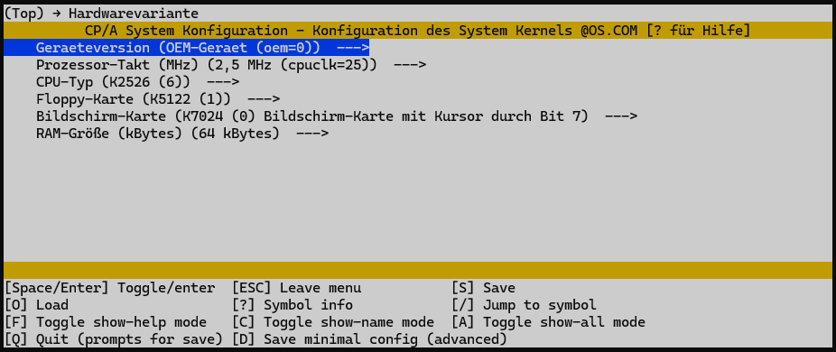

# CPA Workbench – Tool zur Konfiguration des CPA Betriebssystems für Rechner der K1520-Reihe und des PC1715

Dieses Projekt stellt ein Konfigurationswerkzeug bereit, mit dem das CPA-Betriebssystem für verschiedene Rechner der K1520-Reihe und den PC1715 flexibel angepasst und gebaut werden kann. Über ein menübasiertes System lassen sich Systemvarianten, Hardwareoptionen und Build-Parameter komfortabel auswählen und in reproduzierbaren Builds umsetzen.


*Abbildung 1: Konfigurationsmenü - Hardwarevariante BC A5120

Das CPA-Betriebssystem wurde ursprünglich in den 1980er Jahren für verschiedene 8-Bit-Computer entwickelt und jeweils an die spezifische Hardware angepasst. Daher existieren unterschiedliche Varianten im Quelltext, die sich im Detail durch Anpassungen an die Hardware und die im System verbauten EPROMs (Firmware) unterscheiden. In jüngerer Zeit wurden zudem inoffizielle Erweiterungen geschaffen, um neue oder geänderte Hardware zu unterstützen und die Funktionalität zu erweitern.


*Abbildung 2: Konfigurationsmenü - Auswahl Build Ziel

Dieses Konfigurations- und Buildsystem hilft dabei, verschiedene CP/A-Varianten komfortabel zu konfigurieren und zu generieren. Es unterstützt Entwickler und Anwender bei der Anpassung, Weiterentwicklung und dem Test von Erweiterungen und ermöglicht reproduzierbare Builds für unterschiedliche Zielsysteme.


*Abbildung 3: Ausgabe Asembler und Linker mit Übergabe der Adresse

Durch die automatisierte Erstellung und das Schreiben von bootfähigen Systemdisketten oder Images für Diskettenemulatoren wird der Aufwand für das Testen und die Inbetriebnahme neuer Varianten erheblich reduziert.

## Verzeichnisstruktur

- `src/`         – Quelltexte für BIOS, Makros und Systemteile
- `prebuilt/`    – Vorgefertigte Systemteile (z.B. BDOS.ERL, CCP.ERL, CPABAS.ERL)
	- Zusätzlich: `bootsec.bin` – Bootsektor-Datei für die Erstellung bootfähiger Disketten/Images
- `tools/`       – Build-Tools (m80.com, linkmt.com, cpm.exe, ...)
	- `gnu/`           – GNU-Tools für Windows
	- `greaseweazle/`  – Greaseweazle-Tool für Diskettenzugriff unter Windows
	- `python3/`       – Python 3 Runtime für Windows
- `build/`       – Build-Produkte und temporäre Dateien (wird bei jedem Build neu befüllt)
- `examples/`    – Eigene kleine Programme und Beispiel-Makefiles (z.B. hello.mac, name.mac)
- `doc/`         – Dokumentation (z.B. cpa_doc.txt)
- `configmenu/` – Skripte und Konfigurationsdateien für das menübasierte Konfigurationssystem

## Systemüberblick

Das System besteht aus drei Hauptteilen:

- **BIOS** (Quelltext, konfigurierbar)
- **BDOS** (vorgefertigt, Link-Eingabe)
- **CCP** (vorgefertigt, Link-Eingabe)

## Build-Anleitung
## Menübasiertes Konfigurationssystem

Das Buildsystem bietet ein menübasiertes Konfigurationssystem, das über den Befehl

```sh
make menuconfig
```
gestartet wird. Nach dem Aufruf öffnet sich ein mehrstufiges Menü:

1. **Systemvariante auswählen:** Im ersten Schritt wird festgelegt, welche Systemvariante verwendet werden soll (z.B. verschiedene Rechner oder Hardware-Konfigurationen). Es ist möglich, mehrere Systemvarianten im Buildsystem zu hinterlegen und auszuwählen.
2. **Hardware- und Laufwerksoptionen:** Im nächsten Schritt können Hardwaredetails und Diskettenlaufwerke konfiguriert werden.
3. **Build-Optionen:** Abschließend werden Format und weitere Build-Parameter festgelegt.

Jeder Schritt wird interaktiv im Menü durchgeführt. Die getroffene Auswahl wird in der Datei `.config` gespeichert und beim nächsten Build automatisch übernommen. Nach Abschluss der Konfiguration kann das System wie gewohnt gebaut werden (z.B. mit `make config os`).

Das menübasierte System erleichtert die Anpassung und sorgt für reproduzierbare Builds.


### Voraussetzungen

- Linux oder Windows
- Wine (unter Linux, um CP/M-Tools auszuführen)
- Die Tools m80.com, linkmt.com und cpm.exe müssen im Verzeichnis `tools/` liegen

### Build-Prozess unter Linux und Windows

#### Linux
Im Hauptverzeichnis kann der Build-Prozess direkt über die Kommandozeile gestartet werden:
```sh
make
```
Das erzeugte System befindet sich dann als `build/@OS.com`.

#### Windows
Unter Windows wird der Build-Prozess über das Skript `start-cpa-build.cmd` gestartet. Dieses Skript kann per Doppelklick ausgeführt werden und übernimmt folgende Schritte:

1. Prüft, ob Git Bash installiert ist (z.B. unter `C:\Program Files\Git\bin\bash.exe`).
2. Startet Git Bash und ruft darin das Setup-Skript `setup-environment.sh` auf.
3. Die Umgebung verhält sich anschließend wie unter Linux: Es steht eine Bash-Shell zur Verfügung, in der alle Build-Kommandos wie gewohnt ausgeführt werden können (z.B. `make`).

**Hinweis:** Git Bash muss auf dem Rechner installiert sein. Das Setup-Skript richtet die benötigte Umgebung ein (UTF-8, PATH, Tools etc.).


### Aufräumen

```sh
make clean
```
Entfernt alle Build-Produkte und temporäre Dateien.

**Tipp:** Es ist sinnvoll, vor jedem neuen Bauen eines Systems ein `make clean` auszuführen. So werden alte und temporäre Dateien entfernt und mögliche Fehler durch veraltete Build-Artefakte vermieden.

## Konfigurationsmöglichkeiten (BIOS)

Das BIOS ist hochgradig konfigurierbar. Die wichtigsten Optionen werden direkt im Quelltext (`src/bios.mac`) über sogenannte "equates" (Konstanten-Definitionen mit dem Assembler-Befehl `equ`) gesetzt. Die häufigsten Konfigurationsmöglichkeiten und typische Werte sind:

- **RAM-Größe:** `ramkb` (z.B. 64)
- **RAM-Floppy/Erweiterungen:** `oss`, `em256`, `mkd256`, `raf`, `rna` (0/1)
- **Bildschirm (crt):**
 - `K7024` (0): Standard-Bildschirmkarte
 - `DSY5` (1): Invers-Karte 
 - `B1715` (7): PC1715-Bildschirm
- **Tastatur:**
 - `typ80`: 3454 (K7634.54), 36 (K7636-Familie)
 - `kbdotp`: 0 (K7606), 1 (K7604), 2 (DEG-Spezial), 3 (K7633)
- **Laufwerke (diskA, diskB, ...):**
 - 10540: DD, SS, 5", 40 Tracks
 - 10580: DD, SS, 5", 80 Tracks
 - 11580: DD, DS, 5", 80 Tracks
 - 00877: SD, SS, 8", 77 Tracks
 - 10877: DD, SS, 8", 77 Tracks
 - 0: Laufwerk nicht vorhanden
- **Diskettenpuffer:** `dbufsz` (Exponent von 2, z.B. 10 für 1024 Bytes)
- **Weitere Schalter:**
 - `monitor`, `stpvar`, `mprot`, `cpastz`, `errvar`, `uhrvar`, `iobvar`, `costu` (jeweils 0/1)

Die Kommentare im Quelltext geben zu jedem Parameter weitere Hinweise und erlaubte Werte.

- **RAM-Größe:** 
	`ramkb` – RAM in KB (z.B. 64)
- **RAM-Floppy:**  
	`oss`, `em256`, `mkd256`, `raf`, `rna` – Unterstützung verschiedener RAM-Floppy- und Erweiterungskarten
- **Bildschirm:**  
	`crt` – Typ der Bildschirmkarte (z.B. K7024)
	Automatische Erkennung von 24x80 oder 16x64 Zeichen
- **Tastatur:**  
	`typ80`, `kbdotp` – Auswahl und automatische Erkennung verschiedener Tastaturtypen
- **Diskettenlaufwerke:**  
	`diskA`, `diskB`, `diskC`, `diskD` – Typ und Format der unterstützten Laufwerke (5¼", 8", DD/SS/DS)
	`format` – Automatische Formaterkennung aktivieren/deaktivieren
- **Drucker:**  
	`iobtty`, `ioblpt`, `iobuc1` – Konfiguration der Drucker- und Kopplungsschnittstellen
- **Puffergrößen:**  
	`dbufsz` – Größe des Diskettenpuffers (Exponent von 2, z.B. 10 für 1024 Bytes)
- **Sonderfunktionen:**  
	- `monitor` – BIOS-Monitor ein/aus
	- `stpvar` – STOP-Funktion (z.B. für Abbruch)
	- `mprot` – Speicherschutz
	- `cpastz` – Statuszeile
	- `errvar` – BIOS-Fehlermeldungen
	- `uhrvar` – BCD-Uhr
	- `iobvar` – IOBYTE-Unterstützung (flexible Gerätezuordnung)
	- `costu` – Nutzerdefinierte Stringtasten
	- u.v.m.

**Hinweis:**  
Die BIOS-Größe und damit die TPA (Transient Program Area) für Anwenderprogramme hängt direkt von den gewählten Optionen ab. Je mehr Features aktiviert werden, desto kleiner wird die TPA.

### Betriebssystemvarianten

- **Kaltstart:**  
	System wird von @OS.COM auf Diskette geladen, Hardware wird automatisch erkannt (RAM, Bildschirm, Tastatur, Laufwerke).
- **Warmstart:**  
	CCP wird aus dem BIOS kopiert (schneller, keine Systemspuren auf Disketten nötig).
- **Minimal-/Maximal-Konfiguration:**  
	Für Spezialzwecke kann ein sehr kleines BIOS (maximale TPA) oder ein voll ausgestattetes System generiert werden.


### Anpassung

Die Konfiguration erfolgt durch Anpassen der entsprechenden `equ`-Zeilen in `src/bios.mac` vor dem Build. Nach Änderungen einfach erneut `make` ausführen.

## Hinweise

- Die CP/M-Tools können keine Verzeichnisse verarbeiten. Deshalb werden alle benötigten Dateien vor dem Build ins Arbeitsverzeichnis kopiert.
- Die Makefiles sind ausführlich kommentiert und zeigen die einzelnen Schritte.
- Die Systemadresse für das Linken wird automatisch aus der M80-Ausgabe extrahiert.


## Erstellung von Bootdisketten und Unterschiede der Formate

Die Erstellung von Bootdisketten erfolgt über die Makefile-Targets wie `diskimage`, `diskimagehfe`, `diskimagescp` oder `writeimage`. Dabei werden die passenden Geometrien und Bootsektoren automatisch eingebunden.

### 800 kByte Disketten für PC1715
Diese Disketten besitzen keine separaten Bootspuren. Der PC1715 kann direkt von diesen Disketten booten, da spezielle Einträge im 1. und 4. Eintrag der Datenzuordnungstabelle (Directory Allocation Table) gesetzt werden. Die Geometrie ist:
- 80 Zylinder (Tracks)
- 2 Köpfe (Double Side)
- 5 Sektoren à 1024 Bytes pro Track
Das Format ist in `cpa800` (diskdefs/cpaFormates.cfg) beschrieben.

### 720 kByte Disketten für BC A5120
Diese Disketten besitzen separate Bootspuren, die am Anfang der Diskette liegen. Die ersten Spuren enthalten spezielle Sektoren (26 Sektoren a 128 Bytes), die als Bootsektoren dienen. Erst danach folgen die regulären Datenspuren mit 5 Sektoren à 1024 Bytes. Die Geometrie ist:
- 80 Zylinder (Tracks)
- 2 Köpfe (Double Side)
- Bootspuren: 2 Spuren mit 26 Sektoren à 128 Bytes (Kopf 0), 1 Spur mit 26 Sektoren à 128 Bytes (Kopf 1)
- Datenspuren: 5 Sektoren à 1024 Bytes
Das Format ist in `cpa780` (diskdefs/cpaFormates.cfg) beschrieben.


Der Unterschied liegt also in der Bootfähigkeit: Der BC A5120 benötigt explizite Bootspuren, während der PC1715 mit speziellen Einträgen in der Zuordnungstabelle auskommt. Die Makefile-Logik und die Formatdefinitionen sorgen dafür, dass beim Erstellen der Images die korrekten Strukturen und Bootsektoren verwendet werden.

### Verwendung der bootsec.bin
Für die Erstellung bootfähiger Disketten oder Images wird die Datei `bootsec.bin` aus dem jeweiligen `prebuilt/<systemvariante>/`-Ordner verwendet. Diese Datei enthält die notwendigen Bootsektoren und wird beim Image-Bau automatisch an die richtige Stelle im Diskettenimage geschrieben – entweder als separate Bootspuren (BC A5120) oder als spezielle Einträge im Image (PC1715). Dadurch wird sichergestellt, dass die erzeugten Disketten tatsächlich bootfähig sind und den jeweiligen Systemanforderungen entsprechen.

---
Das Erstellen und Schreiben von Systemdisketten erfolgt komfortabel über das Makefile und die bereitgestellten Targets:

- **diskImage**: Erstellt ein Standard-Diskettenimage (`build/cpadisk.img`).
- **diskimagehfe**: Erstellt ein HFE-Diskettenimage für Emulatoren und spezielle Hardware.
- **diskimagescp**: Erstellt ein SCP-Diskettenimage für erweiterte Kompatibilität.
- **writeimage**: Schreibt das erzeugte Diskettenimage direkt auf eine physikalische Diskette, sofern ein Greaseweazle-Laufwerk angeschlossen ist.

Die Auswahl des gewünschten Ziel-Formats (IMG, HFE, SCP oder direktes Schreiben) kann entweder direkt über die Makefile-Targets erfolgen (z.B. `make diskimagehfe`), oder komfortabel über das menübasierte Konfigurationssystem (`make menuconfig`).

Zusatztools aus dem Verzeichnis `additions/` werden automatisch mit auf die Systemdiskette kopiert und stehen nach dem Booten zur Verfügung.

**Hinweis:**
- Die Systemdiskette enthält nach dem Build alle im additions-Ordner befindlichen Tools.
- Für den Schreibvorgang werden ggf. Administratorrechte benötigt.


## Diskettenformate: diskdefs und cpaFormates.cfg

Die Diskettenformate für das Erstellen einer CP/A-Diskette, eines Diskettenimages oder für das Skript `extract_files` sind in zwei Dateien beschrieben:

- **diskdefs**: Enthält die Definitionen für das CP/M-Dateisystem (z.B. Sektorgröße, Anzahl der Tracks, Verzeichnisstruktur). Diese Datei wird von cpmtools und beim Erstellen von Images verwendet.
- **cpaFormates.cfg**: Beschreibt die physikalische Geometrie und das Aufzeichnungsverfahren der Disketten (z.B. Anzahl der Zylinder, Köpfe, Sektoren, MFM-Codierung). Diese Datei wird von Greaseweazle und beim direkten Zugriff auf Disketten genutzt.

Beide Dateien sind essenziell, um die korrekten Formate für das Buildsystem und das Extrahieren von Dateien mit `extract_files` zu gewährleisten. So kann sowohl das logische Dateisystem als auch die physikalische Struktur der Diskette exakt abgebildet werden.

**Hinweis:** Die Dateien `diskdefs` und `cpaFormates.cfg` können bei Bedarf angepasst werden, wenn z.B. Disketten von einem anderen System gelesen oder CP/A System-Disketten für andere Systeme und Formate erstellt werden sollen.

## Zusatztool: extract_files

Das Skript `extract_files` dient dazu, alle Dateien aus einem CP/M-Diskettenimage oder direkt von einer Diskette (über Greaseweazle) in ein neues Verzeichnis zu extrahieren. Es unterstützt verschiedene Formate und kann sowohl Images als auch physische Disketten verarbeiten.

**Funktionen:**
- Extrahiert alle Dateien aus einem Image (`.img`) oder direkt von Diskette.
- Unterstützt verschiedene Dateisystemformate (z.B. cpa800).
- Legt die extrahierten Dateien in einem neuen Unterordner im Verzeichnis `Disketten/` ab.
- Temporäre Images werden nach der Extraktion automatisch gelöscht.

**Verwendung:**
```sh
./extract_files [-t FORMAT] -f <disk_image.img> | -g <DiskName>
```
- `-t FORMAT`   Dateisystemformat für cpmtools (Standard: cpa800)
- `-f FILE`     Image-Datei einlesen (z.B. foo.img)
- `-g DiskName` Diskette mit Greaseweazle einlesen (legt DiskName.img temporär an)
- `-h`          Zeigt Hilfe an

Die extrahierten Dateien werden im Ordner `Disketten/<ImageName>/` abgelegt. Nach Abschluss wird die Anzahl der extrahierten Dateien ausgegeben.

## Lizenz
Bitte beachte die Lizenzhinweise in den Quelldateien und Dokumenten.

---

Fragen und Beiträge sind willkommen!
