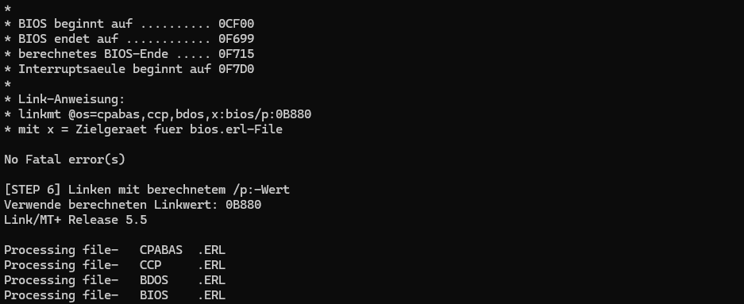

# CPA Workbench

[](./LICENSE)
[](https://github.com/olliy78/CPA_Workbench/releases)

This project provides a configuration and build tool for the CPA operating system, targeting classic East German computers of the K1520 series and the PC1715. It enables flexible selection of system variants, hardware options, and build parameters for reproducible builds and disk images. Note: The software and documentation are primarily in German, and it is assumed that there are probably no non-German-speaking users for this tool.

## Tool zur Konfiguration des CPA Betriebssystems für Rechner der K1520-Reihe und des PC1715

Dieses Projekt stellt ein Konfigurationswerkzeug bereit, mit dem das CPA-Betriebssystem für verschiedene Rechner der K1520-Reihe und den PC1715 flexibel angepasst und gebaut werden kann. Über ein menübasiertes System lassen sich Systemvarianten, Hardwareoptionen und Build-Parameter komfortabel auswählen und in reproduzierbaren Builds umsetzen.


*Abbildung 1: Konfigurationsmenü - Hardwarevariante BC A5120

Das CPA-Betriebssystem wurde ursprünglich in den 1980er Jahren für verschiedene 8-Bit-Computer entwickelt und jeweils an die spezifische Hardware angepasst. Daher existieren unterschiedliche Varianten im Quelltext, die sich im Detail durch Anpassungen an die Hardware und die im System verbauten EPROMs (Firmware) unterscheiden. In jüngerer Zeit wurden zudem inoffizielle Erweiterungen geschaffen, um neue oder geänderte Hardware zu unterstützen und die Funktionalität zu erweitern.


*Abbildung 2: Konfigurationsmenü - Auswahl Build Ziel

Dieses Konfigurations- und Buildsystem hilft dabei, verschiedene CP/A-Varianten komfortabel zu konfigurieren und zu generieren. Es unterstützt Entwickler und Anwender bei der Anpassung, Weiterentwicklung und dem Test von Erweiterungen und ermöglicht reproduzierbare Builds für unterschiedliche Zielsysteme.


*Abbildung 3: Ausgabe Assembler und Linker mit Übergabe der Adresse

Durch die automatisierte Erstellung und das Schreiben von bootfähigen Systemdisketten oder Images für Diskettenemulatoren wird der Aufwand für das Testen und die Inbetriebnahme neuer Varianten erheblich reduziert.

## Versionshistorie

### Version 0.2.0 (Beta)

**Status:** Beta-Version für öffentliche Tests

**Änderungen gegenüber Version 0.1.0:**

- **Fehlerbeseitigungen:** Diverse Bugs wurden behoben, um die Stabilität und Zuverlässigkeit des Build-Systems zu verbessern
- **CP/A Quelltext:** Alle Änderungen im CP/A Quelltext wurden zurückgesetzt, um die Originalversion zu verwenden
- **Verbesserungen:** Optimierungen am Build-Prozess und der Systemkonfiguration

**Hinweis:** Version 0.2.0 ist weiterhin als Beta-Version zu verstehen und befindet sich in der öffentlichen Testphase.

### Version 0.1.0

**Status:** Initiale Version

Dies war die erste öffentliche Version der CPA Workbench mit grundlegender Funktionalität für das Konfigurieren und Bauen von CP/A-Betriebssystemen.

## Installationsanleitung

### Windows

Das Programmpaket enthält fast alle Komponenten, die für den Betrieb unter Windows benötigt werden. Für die Installation wird lediglich 7-Zip benötigt. Das Projekt kann als .zip-Datei oder per `git clone` von GitHub heruntergeladen werden. Im Ordner `tools` muss die Datei `win_tools.7z` entpackt werden; sie enthält nahezu alle externen Abhängigkeiten des Projekts.

Enthaltene Komponenten in `tools/win_tools.7z`:

- **PortableGit**: Enthält die Git Bash, die als Shell für das Build-System verwendet wird. Zusätzlich sind verschiedene GNU-Tools wie `dd`, `sed`, `ed`, `grep` und `awk` enthalten, die in den Skripten benötigt werden.
- **make**: GNU Make für Windows.
- **python3**: Minimale Python-3-Umgebung für Windows.
- **greaseweazle**: Tool zum Lesen und Schreiben von Disketten sowie zum Konvertieren verschiedener Disketten-Image-Formate.

Zusätzlich befinden sich im Ordner `tools` die CP/M-Tools `cpmcp` und `cpmls` sowie der CP/M-Emulator `cpm.exe`.

Zum Start der CP/A Workbench muss das Script start-cpa-build.cmd im Hauptverzeichnis (z.B. per Doppelklick) ausgeführt werden.

### Linux and Mac

Für die Verwendung unter Linux und Mac wird der Windows-Emulator Wine benötigt, da der verwendete CP/M-Emulator nur als 32-Bit-Windows-Version verfügbar ist. Ein alternativer CP/M-Emulator wurde bisher nicht erfolgreich getestet.

Die Tools `make`, `python3` und `greaseweazle` müssen über die jeweiligen Paketmanager installiert werden, falls sie nicht bereits vorhanden sind.

Für die CP/M-Tools `cpmcp` und `cpmls` liegen im Ordner `tools` bereits unter Debian Linux kompilierte Versionen bei. Sollten diese Dateien nicht funktionieren, wird empfohlen, die CP/M-Tools selbst aus dem Quelltext zu übersetzen. Das mit Debian ausgelieferte Binärpaket ist fehlerhaft und verhält sich bei den hier verwendeten Diskettenformaten nicht wie erwartet.

## Verzeichnisstruktur

- `src/`         – Quelltexte für BIOS, Makros und Systemteile
- `prebuilt/`    – Vorgefertigte Systemteile (z.B. BDOS.ERL, CCP.ERL, CPABAS.ERL)
  - Zusätzlich: `bootsec.bin` – Bootsektor-Datei für die Erstellung bootfähiger Disketten/Images
- `tools/`       – Build-Tools (m80.com, linkmt.com, cpm.exe, ...)
  - `gnu/`           – GNU-Tools für Windows
  - `greaseweazle/`  – Greaseweazle-Tool für Diskettenzugriff unter Windows
  - `python3/`       – Python 3 Runtime für Windows
- `build/`       – Build-Produkte und temporäre Dateien (wird bei jedem Build neu befüllt)
- `examples/`    – Eigene kleine Programme und Beispiel-Makefiles (z.B. hello.mac, name.mac)
- `doc/`         – Dokumentation (z.B. cpa_doc.txt, gide_erweiterung.md für die GIDE-Erweiterung des BC A5120)
- `config/` – Skripte und Konfigurationsdateien für das menübasierte Konfigurationssystem

## Build-System Übersicht

Das CPA Workbench Build-System bietet verschiedene Wege zur Konfiguration und zum Bau des Systems:

### 1. Menübasiertes Konfigurationssystem (empfohlener Weg)

Das Buildsystem bietet ein menübasiertes Konfigurationssystem, das über den Befehl

```sh
make menuconfig
```

gestartet wird. Nach dem Aufruf öffnet sich ein mehrstufiges Menü:

1. **Systemvariante auswählen:** Im ersten Schritt wird festgelegt, welche Systemvariante verwendet werden soll. Aktuell stehen vier Systemvarianten zur Verfügung: BC A5120, BC A5120 mit GIDE-Erweiterung, PC1715 und PC1715 (Version 870330)
2. **Hardware- und Laufwerksoptionen:** Im nächsten Schritt können Hardwaredetails und Diskettenlaufwerke konfiguriert werden. Hier werden vordefinierte Einstellungen in die entsprechenden .mac-Dateien gepatcht (z.B. Laufwerkskonfiguration, serielle Schnittstellen)
3. **Build-Optionen:** Abschließend werden Ausgabeformat und weitere Build-Parameter festgelegt
4. **Hilfetexte:** Zu allen Optionen sind Hilfetexte verfügbar (mit [?] im Menü oder [F] für dauerhafte Anzeige)

Die getroffene Auswahl wird in der Datei `.config` gespeichert und beim nächsten Build automatisch verwendet. Nach Abschluss der Konfiguration wird das System automatisch neu gebaut.

### 2. Config-basierte Builds (empfohlener Build-Weg)

Nach der Konfiguration sollten alle Builds mit dem `config`-Wrapper ausgeführt werden:

```sh
make config os            # Baut das Betriebssystem (@OS.COM) gemäß .config
make config diskimage     # Erstellt Diskettenimage (IMG-Format)
make config diskimagehfe  # Erstellt HFE-Diskettenimage
make config diskimagescp  # Erstellt SCP-Diskettenimage
make config writeimage    # Schreibt Image auf physikalisches Laufwerk
```

Der `config`-Wrapper stellt sicher, dass die Builds reproduzierbar sind und die aktuellen Konfigurationseinstellungen verwendet werden.

### 3. Direkte Builds (für Entwickler und Experimente)

Für erweiterte Nutzung oder Experimente können auch direkte Builds ohne `.config` durchgeführt werden:

```sh
make os                   # Baut mit fest eingetragenem DEFAULT_SYSTEMVAR
make pc_1715 os          # Baut für spezifische Systemvariante
make clean               # Entfernt Build-Artefakte
```

**Wichtiger Hinweis:** Die Standardsystemvariante ist über `DEFAULT_SYSTEMVAR := pc_1715` im Makefile festgelegt. Dies wird als Fallback verwendet, wenn keine `.config` existiert oder bei direkten Builds.

### Systemvarianten und Ordnerstruktur

Das Build-System erkennt Systemvarianten automatisch anhand der Ordnerstruktur:

- **Quelltexte:** `src/<systemvariante>/` (z.B. `src/pc_1715/`)
- **Konfiguration:** `config/<systemvariante>/` mit variantenspezifischem Makefile
- **Prebuilt-Files:** `prebuilt/<systemvariante>/` (BDOS, CCP, Bootsektor etc.)
- **Additions:** `additions/<systemvariante>/` (optionale systemspezifische Tools)

### Voraussetzungen

- Linux oder Windows
- Wine (unter Linux, um CP/M-Tools auszuführen)
- Die Tools m80.com, linkmt.com und cpm.exe müssen im Verzeichnis `tools/` liegen

### Build-Prozess unter Linux und Windows

#### Linux Build

Im Hauptverzeichnis kann der Build-Prozess direkt über die Kommandozeile gestartet werden:

```sh
make menuconfig
```

#### Windows Build

Unter Windows wird der Build-Prozess über das Skript `start-cpa-build.cmd` gestartet. Dieses Skript kann per Doppelklick ausgeführt werden und übernimmt folgende Schritte:

1. Prüft, ob Git Bash installiert ist (z.B. innerhalb des tools-Ordners). Sollte die Bash woanders liegen, muss das Skript angepasst werden
2. Startet Git Bash und ruft darin das Setup-Skript `setup-environment.sh` auf
3. Die Umgebung verhält sich anschließend wie unter Linux: Es steht eine Bash-Shell zur Verfügung, in der alle Build-Kommandos wie gewohnt ausgeführt werden können

```sh
make menuconfig
```

**Hinweis:** Git Bash muss auf dem Rechner installiert sein. Das Setup-Skript richtet die benötigte Umgebung ein (UTF-8, PATH, Tools etc.) und prüft, ob alle notwendigen Tools (make, python3, greaseweazle) verfügbar sind.

### Aufräumen

```sh
make clean
```

Entfernt alle Build-Produkte und temporäre Dateien.

**Tipp:** Es ist sinnvoll, vor jedem neuen Build ein `make clean` auszuführen, besonders nach Konfigurationsänderungen. So werden alte Build-Artefakte entfernt und mögliche Fehler durch veraltete Dateien vermieden.

## Erweiterte Möglichkeiten für Entwickler

Das Build-System kann weit über das Menü hinaus flexibel und direkt über die Kommandozeile genutzt werden. Dies ist besonders hilfreich für Entwickler, die eigene Experimente, Erweiterungen oder spezielle Anpassungen vornehmen möchten.

### Systemvarianten und DEFAULT_SYSTEMVAR

Das Build-System erkennt vorhandene Systemvarianten automatisch anhand der Ordnerstruktur und bietet diese im Menüsystem zur Auswahl an. Die Auswahl wird dann in der .config gespeichert. Wenn das Menüsystem und die .config nicht verwendet werden sollen, kann die Standard-Systemvariante im Makefile als `DEFAULT_SYSTEMVAR := pc_1715` festgelegt werden und wird in folgenden Fällen verwendet:

- Bei direkten Builds ohne `.config` (z.B. `make os`)
- Als Fallback, wenn keine `.config` existiert
- Bei unvollständiger Konfiguration

**Praktische Build-Beispiele:**

```sh
# Kompletter Build mit Konfiguration
make menuconfig          # Konfiguration setzen
make clean               # Aufräumen
make config diskimage    # Image gemäß .config erstellen
make config writeimage   # Image auf Diskette schreiben (Greaseweazle erforderlich)

# Direkter Build ohne .config und Menü
make os
make pc_1715 os         
make pc_1715 diskimagehfe
```

### Makefile-Parameter und Build-Anpassungen

Das Makefile unterstützt verschiedene Parameter zur Anpassung des Build-Prozesses:

**Wichtige Build-Variablen:**

- `SYSTEMVAR` – Systemvariante (automatisch erkannt oder aus DEFAULT_SYSTEMVAR)
- `BUILD_DIR` – Zielverzeichnis für Build-Produkte (Standard: `build/`)
- `SRC_DIR` – Quelltextverzeichnis (Standard: `src/<systemvariante>/`)
- `PREBUILT_DIR` – Vorgefertigte Systemteile (Standard: `prebuilt/<systemvariante>/`)
- `TOOLS_DIR` – Build-Tools-Verzeichnis (Standard: `tools/`)
- `CPM` – CP/M-Emulator-Pfad (automatisch: Linux via Wine, Windows direkt)

### Eigene Systemvariante anlegen – Schritt für Schritt

Das Anlegen einer eigenen Systemvariante ist ideal für Experimente, Erweiterungen oder spezielle Hardwareanpassungen. Gehe dabei wie folgt vor:

1. **Verzeichnisse anlegen:**

- `src/<neue_variante>/` – Quelltexte für BIOS, Makros etc. (z.B. von `src/bc_a5120` kopieren)
- `prebuilt/<neue_variante>/` – Vorgefertigte Systemteile (z.B. BDOS.ERL, CCP.ERL, bootsec.bin)
- `config/<neue_variante>/Kconfig.system` – Konfigurationsdatei für das Menüsystem
- `config/<neue_variante>/Makefile` – Systemvariantenspezifisches Makefile
- `additions/<neue_variante>/` – Zusatztools, die auf die Diskette kopiert werden sollen

1. **Dateien anpassen:**

Das Kconfig-System bildet die Grundlage für das menübasierte Konfigurationssystem und steuert, welche Optionen beim Build gesetzt werden können. Jede Systemvariante besitzt eine eigene `Kconfig.system`-Datei im jeweiligen `config/<systemvariante>/`-Verzeichnis. Diese Datei beschreibt die verfügbaren Konfigurationsoptionen, deren Typen und die Zuordnung zu Symbolnamen in den Assembler-Quelltexten (z.B. in `bios.mac`).

Das Makefile steuert den Bau der @OS.COM aus den .mac- und .erl-Dateien. Es wird vom Haupt-Makefile im Hauptordner aufgerufen. Je nach Systemvariante kann es sein, dass sich Dateinamen oder Aufrufparameter von Assembler und Linker ändern. In diesem Fall muss das systemspezifische Makefile angepasst werden.

3. **Build durchführen:**

- Wähle die neue Variante im Menüsystem aus (`make menuconfig`) oder setze `SYSTEMVAR` beim Build:
  
  ```sh
  make os SYSTEMVAR=<neue_variante>
  make diskimage SYSTEMVAR=<neue_variante>
  ```

**Tipp:**
Starte mit einer Kopie einer lauffähigen Variante (z.B. `bc_a5120`) und passe die Dateien schrittweise an. So kannst du gezielt experimentieren und Erweiterungen testen, ohne das Originalsystem zu verändern.

### Anpassung Kconfig.system

- Jede Option ist einem bestimmten Datentyp zugeordnet:
  - `bool` – Ein-/Ausschalter (true/false), z.B. für Hardwarefeatures oder Auswahlfelder verwendeter Laufwerkstyp
  - `hexstring` – Hexadezimale Werte, z.B. Adressen
  - `string` – Freitext, z.B. Versionsbezeichnung oder Textfelder
- Die Option enthält mindestens einen Symbolnamen, der in der zu modifizierenden `.mac`-Datei verwendet wird.
- Der Wert, der im Menü gewählt wird, wird beim Build automatisch in die entsprechende `.mac`-Datei gepatcht.

**Beispiele für Optionen:**

```kconfig
config SYSTEM_RAMDISK_RAF
    bool "RAF-Karte (raf=1)"
    help
        source=bios.mac oss=0 em256=0 raf=1
        Nutzt mindestens eine RAF-Karte (max. 4, je 2MB) als RAM-Floppy 'M:'.
config SYSTEM_DRIVE_A_11580
    bool "DD, DS, 5', 80 Tracks (K5601 !!!)"
    help
        source=bios.mac diskA=11580
        Verwendet K5601 als Laufwerk A

config SYSTEM_AUTOEXEC_STR
    string "Automatische Kommando-Ausführung (autoexec)"
    help
        source=bios.mac kltbef=string
        Es besteht die Moeglichkeit, beim Kaltstart des Systems automatisch
        ein Kommando auszufuehren z.B. 'DIR *.COM'. Dies kann auch ueber SUBMIT eine Kommando-
        folge sein.

config SYSTEM_SERIAL_TTYDAT
    string "ttydat (Daten-Adresse Drucker 1)"
    help
        source=bios.mac ttydat=hexstring
        Datenadresse für Drucker 1. Mögliche Anschlüsse und Adressen:
        Printer (nur senden) 0ch, V24 0dh, Kanal A (IFSS) 14h, Kanal B (IFSS) 15h
        Siehe bios.mac Zeilen 349-387 für weitere Karten und Bemerkungen.
```

In den vorhandenen Konfigurationsdateien für bc_a5120 und pc_1715 sind viele weitere Beispiele zum Übernehmen und Anpassen vorhanden

**Anpassungen bei einer neuen Systemvariante:**

- Die `Kconfig.system` muss alle relevanten Optionen enthalten, die für die Hardware und das BIOS der neuen Variante benötigt werden.
- Für jede Option muss der Symbolname mit dem Namen in der `.mac`-Datei übereinstimmen.
- Der Datentyp muss passend gewählt werden (z.B. `bool` für Features, `hexstring` für Adressen).
- Die `source`-Angabe muss auf die korrekte `.mac`-Datei zeigen, die beim Build modifiziert werden soll.

### Variantenspezifisches Makefile

Im `config/<systemvariante>/`-Verzeichnis muss ein systemspezifisches Makefile erstellt werden, das den eigentlichen Build-Prozess für diese Variante steuert. Dieses Makefile wird vom Haupt-Makefile aufgerufen und übernimmt folgende Aufgaben:

**1. Assembler-Aufruf (M80):**
Das Makefile ruft den Z80-Assembler M80 auf, um die Quelltexte zu assemblieren:

```makefile
$(CPM) m80 =$(SRC_DIR)/bios.mac
```

Der Assembler erzeugt eine `.REL`-Datei und gibt dabei automatisch die Ladeadresse aus, die für den nachfolgenden Linker-Schritt benötigt wird.

**2. Extraktion der Linker-Adresse:**
Die vom Assembler ausgegebene Systemadresse wird automatisch aus der M80-Ausgabe extrahiert:

```makefile
SYSADR = $(shell $(CPM) m80 =$(SRC_DIR)/bios.mac 2>&1 | grep -i "system" | awk '{print $$NF}')
```

Diese Adresse wird dann an den Linker weitergegeben.

**3. Linker-Aufruf (LINKMT):**
Der Linker LINKMT wird mit der extrahierten Systemadresse und allen erforderlichen .REL- und .ERL-Dateien aufgerufen:

```makefile
$(CPM) linkmt $(BUILD_DIR)/bios.rel[s$(SYSADR)],$(BUILD_DIR)/@os.com=$(PREBUILT_DIR)/bdos.erl,$(PREBUILT_DIR)/ccp.erl,$(PREBUILT_DIR)/cpabas.erl
```

**4. Verwendung korrekter Dateinamen:**
Im Makefile muss sichergestellt werden, dass die richtigen Dateien verwendet werden:

- Hauptquelldatei: `$(SRC_DIR)/bios.mac` (systemvariantenspezifische BIOS-Quellen)
- Ausgabedatei: `$(BUILD_DIR)/@os.com` (das fertige Betriebssystem)
- Arbeitsverzeichnis: Alle Dateien werden ins `$(BUILD_DIR)` kopiert, da CP/M-Tools keine Pfade verstehen

**5. Einbindung von Prebuilt-.ERL-Dateien:**
Vorgefertigte Systemkomponenten werden beim Linken eingebunden:

- `bdos.erl` – Das Basic Disk Operating System
- `ccp.erl` – Die Console Command Processor
- `cpabas.erl` – Wird irgendwie auch benötigt
- Weitere systemspezifische .ERL-Dateien nach Bedarf

Das variantenspezifische Makefile kann von einem bestehenden System (z.B. `config/pc_1715/Makefile`) kopiert und entsprechend den Anforderungen der neuen Systemvariante angepasst werden.

### Hinweise zum Build-System

- Die CP/M-Tools können keine Verzeichnisse verarbeiten. Alle benötigten Dateien werden vor dem Build ins Arbeitsverzeichnis kopiert.
- Die Makefiles sind ausführlich kommentiert und zeigen die einzelnen Schritte.
- Die Systemadresse für das Linken wird automatisch aus der M80-Ausgabe extrahiert.

---

## Erstellung von Bootdisketten und Unterschiede der Formate

Die Erstellung von Bootdisketten erfolgt über die Makefile-Targets wie `diskimage`, `diskimagehfe`, `diskimagescp` oder `writeimage`. Dabei werden die passenden Geometrien und Bootsektoren automatisch eingebunden.

### 800 kByte Disketten für PC1715

Diese Disketten besitzen keine separaten Bootspuren. Der PC1715 kann direkt von diesen Disketten booten, da spezielle Einträge im 1. und 4. Eintrag der Datenzuordnungstabelle (Directory Allocation Table) gesetzt werden. Die Geometrie ist:

- 80 Zylinder (Tracks)
- 2 Köpfe (Double Side)
- 5 Sektoren à 1024 Bytes pro Track
Das Format ist in `cpa800` (diskdefs/cpaFormates.cfg) beschrieben.

### 720 kByte Disketten für BC A5120

Diese Disketten besitzen separate Bootspuren, die am Anfang der Diskette liegen. Die ersten Spuren enthalten spezielle Sektoren (26 Sektoren a 128 Bytes), die als Bootsektoren dienen. Erst danach folgen die regulären Datenspuren mit 5 Sektoren à 1024 Bytes. Die Geometrie ist:

- 80 Zylinder (Tracks)
- 2 Köpfe (Double Side)
- Bootspuren: 2 Spuren mit 26 Sektoren à 128 Bytes (Kopf 0), 1 Spur mit 26 Sektoren à 128 Bytes (Kopf 1)
- Datenspuren: 5 Sektoren à 1024 Bytes
Das Format ist in `cpa780` (diskdefs/cpaFormates.cfg) beschrieben.

Der Unterschied liegt also in der Bootfähigkeit: Der BC A5120 benötigt explizite Bootspuren, während der PC1715 mit speziellen Einträgen in der Zuordnungstabelle auskommt. Die Makefile-Logik und die Formatdefinitionen sorgen dafür, dass beim Erstellen der Images die korrekten Strukturen und Bootsektoren verwendet werden.

### Verwendung der bootsec.bin

Für die Erstellung bootfähiger Disketten oder Images wird die Datei `bootsec.bin` aus dem jeweiligen `prebuilt/<systemvariante>/`-Ordner verwendet. Diese Datei enthält die notwendigen Bootsektoren und wird beim Image-Bau automatisch an die richtige Stelle im Diskettenimage geschrieben – entweder als separate Bootspuren (BC A5120) oder als spezielle Einträge im Image (PC1715). Dadurch wird sichergestellt, dass die erzeugten Disketten tatsächlich bootfähig sind und den jeweiligen Systemanforderungen entsprechen.

---
Das Erstellen und Schreiben von Systemdisketten erfolgt komfortabel über das Makefile und die bereitgestellten Targets:

- **diskImage**: Erstellt ein Standard-Diskettenimage (`build/cpadisk.img`).
- **diskimagehfe**: Erstellt ein HFE-Diskettenimage für Emulatoren und spezielle Hardware.
- **diskimagescp**: Erstellt ein SCP-Diskettenimage für erweiterte Kompatibilität.
- **writeimage**: Schreibt das erzeugte Diskettenimage direkt auf eine physikalische Diskette, sofern ein Greaseweazle-Laufwerk angeschlossen ist.

Die Auswahl des gewünschten Ziel-Formats (IMG, HFE, SCP oder direktes Schreiben) kann entweder direkt über die Makefile-Targets erfolgen (z.B. `make diskimagehfe`), oder komfortabel über das menübasierte Konfigurationssystem (`make menuconfig`).

Zusatztools aus dem Verzeichnis `additions/` werden automatisch mit auf die Systemdiskette kopiert und stehen nach dem Booten zur Verfügung.

**Hinweis:**
Die Systemdiskette enthält nach dem Build alle im additions-Ordner befindlichen Tools.
Für den Schreibvorgang werden ggf. Administratorrechte benötigt.

## Diskettenformate: diskdefs und cpaFormates.cfg

Die Diskettenformate für das Erstellen einer CP/A-Diskette, eines Diskettenimages oder für das Skript `extract_files` sind in zwei Dateien beschrieben:

- **diskdefs**: Enthält die Definitionen für das CP/M-Dateisystem (z.B. Sektorgröße, Anzahl der Tracks, Verzeichnisstruktur). Diese Datei wird von cpmtools und beim Erstellen von Images verwendet.
- **cpaFormates.cfg**: Beschreibt die physikalische Geometrie und das Aufzeichnungsverfahren der Disketten (z.B. Anzahl der Zylinder, Köpfe, Sektoren, MFM-Codierung). Diese Datei wird von Greaseweazle und beim direkten Zugriff auf Disketten genutzt.

Beide Dateien sind essenziell, um die korrekten Formate für das Buildsystem und das Extrahieren von Dateien mit `extract_files` zu gewährleisten. So kann sowohl das logische Dateisystem als auch die physikalische Struktur der Diskette exakt abgebildet werden.

**Hinweis:**
Die Dateien `diskdefs` und `cpaFormates.cfg` können bei Bedarf angepasst werden, wenn z.B. Disketten von einem anderen System gelesen oder CP/A System-Disketten für andere Systeme und Formate erstellt werden sollen.

## Zusatztool: extract_files

Das Skript `extract_files` dient dazu, alle Dateien aus einem CP/M-Diskettenimage oder direkt von einer Diskette (über Greaseweazle) in ein neues Verzeichnis zu extrahieren. Es unterstützt verschiedene Formate und kann sowohl Images als auch physische Disketten verarbeiten.

**Funktionen:**

- Extrahiert alle Dateien aus einem Image (`.img`) oder direkt von Diskette.
- Unterstützt verschiedene Dateisystemformate (z.B. cpa800).
- Legt die extrahierten Dateien in einem neuen Unterordner im Verzeichnis `Disketten/` ab.
- Temporäre Images werden nach der Extraktion automatisch gelöscht.

**Verwendung:**

```sh
tools/extract_files [-t FORMAT] -f <disk_image.img> | -g <DiskName>
```

- `-t FORMAT`   Dateisystemformat für cpmtools (Standard: cpa800)
- `-f FILE`     Image-Datei einlesen (z.B. foo.img)
- `-g DiskName` Diskette mit Greaseweazle einlesen (legt DiskName.img temporär an)
- `-h`          Zeigt Hilfe an

Die extrahierten Dateien werden im Ordner `Disketten/<ImageName>/` abgelegt. Nach Abschluss wird die Anzahl der extrahierten Dateien ausgegeben.

Um die extrahierten Dateien danach wieder auf die zu erstellenden Disketten zu bekommen, brauchen sie einfach nur in den Ordner additions kopiert werden. Wenn es sich um systemvariantenspezifische Dateien handelt, in den entsprechenden Unterordner. Dadurch wird erreicht, dass eine FORMAT.COM für einen PC1715 nicht auf die Startdiskette für einen A5120 kopiert wird.

## Lizenz

Die CPA-Workbench (alle eigenen Skripte, Buildsysteme und Dokumente in diesem Repository) steht unter der MIT-Lizenz. Siehe dazu die Datei [LICENSE](./LICENSE) im Hauptverzeichnis.

**Wichtiger Hinweis:**

- Die MIT-Lizenz gilt ausschließlich für die CPA-Workbench und die zugehörigen eigenen Dateien (eigene Skripte, Buildsysteme und Dokumente).
- Das Betriebssystem CP/A sowie alle eventuell mitgelieferten Originaldateien aus CP/A (einschließlich cpa_doc.txt) unterliegen anderen Lizenzen und sind ausdrücklich von der MIT-Lizenz ausgenommen.
- Externe Programme und Tools im Ordner `tools` (z.B. make, Python, Greaseweazle, cpmtools, CP/M-Emulator, m80, linkmt) stehen jeweils unter eigenen Lizenzen, die beachtet werden müssen.
- Auch die Dateien `menuconfig.py` und `kconfiglib.py` im Ordner `config` stehen unter abweichenden Lizenzen, die in den jeweiligen Dateien selbst beschrieben sind.
- Bitte prüfe die jeweiligen Lizenzdateien und Hinweise in den entsprechenden Unterordnern oder auf den Homepages der jeweiligen Tools und Komponenten.

---

## Bug-Reports und Erweiterungswünsche

Für Fehler, Verbesserungsvorschläge oder neue Funktionen nutze bitte das [GitHub-Ticketsystem (Issues)](https://github.com/olliy78/CPA_Workbench/issues).

- **Fehlerberichte:** Melde Bugs und Probleme über die Vorlage „Fehlerbericht“.
- **Erweiterungswünsche:** Schlage neue Funktionen oder Verbesserungen über die Vorlage „Erweiterungswunsch“ vor.
- **Fragen:** Auch allgemeine Fragen können als Issue eingestellt werden.

Bitte prüfe vor dem Erstellen eines neuen Tickets, ob das Thema bereits gemeldet wurde.

**Hinweis:**  
Für Bug-Reports und Feature-Requests stehen strukturierte deutsche Vorlagen zur Verfügung, die dir beim Ausfüllen helfen.

Direkt zum Ticketsystem: [GitHub Issues](https://github.com/olliy78/CPA_Workbench/issues)

Für allgemeine Fragen und Diskussionen kann auch das Forum von [robotrontechnik.de](https://www.robotrontechnik.de) genutzt werden.

Fragen und Beiträge sind willkommen!
